# Image Classification with finetuned GoogleLeNet 

In my previous post [Convolutional neural network for image classification from scratch](http://machinememos.com/python/artificial%20intelligence/machine%20learning/cifar10/neural%20networks/convolutional%20neural%20network/dropout/image%20classification/2017/04/23/convolutional-neural-network-from-scratch.html) I built a small convolutional neural network (CNN) to classify images from the [CIFAR-10 dataset](https://www.cs.toronto.edu/~kriz/cifar.html). My goal was to demonstrate how easy one can construct a neural network with descent accuracy (around 67%). However, for many real word problems building CNNs from scratch might not be practical. For instance, in a recent [kaggle](http://kaggle.com/) challenge called [Dog vs Cat](https://www.kaggle.com/c/dogs-vs-cats) the competitors were asked to correctly classify images of dogs and cats. In an insightful [interview](http://blog.kaggle.com/2017/04/03/dogs-vs-cats-redux-playground-competition-winners-interview-bojan-tunguz/) the winner of that challenge explained that he didn't rely solely on a CNN that he built from scratch. Instead he got his hands on multiple models already trained with large datasets and applied some "finetuning" in order to make these fit for the specific goal of classifying cats and dogs. So how does this work? The idea is simple. There are hundreds of models already trained on a specific dataset. The largest repository I know is the [Model Zoo Github Repo](https://github.com/BVLC/caffe/wiki/Model-Zoo). There are also the models from the [Tensorflow Slim Project](https://github.com/tensorflow/models/tree/master/slim). So the goal is to select a model that is already trained on a dataset that is similar to the one you are interested in. After selecting the model one has to apply some "finetuning" on it. Interested? Well continue reading, as this is exactly what I am going to do in this post.  

# Cifar-10 Image Dataset

If you are already familiar with my previous post [Convolutional neural network for image classification from scratch](http://machinememos.com/python/artificial%20intelligence/machine%20learning/cifar10/neural%20networks/convolutional%20neural%20network/dropout/image%20classification/2017/04/23/convolutional-neural-network-from-scratch.html), you might want to skip the next sections and go directly to **Converting datasets to .tfrecord**.

The [CIFAR-10 dataset](https://www.cs.toronto.edu/~kriz/cifar.html) consists of 60000 32x32 colour images in 10 categories - airplanes, dogs, cats, and other objects. The dataset is divided into five training batches and one test batch, each with 10000 images. The test batch contains exactly 1000 randomly-selected images from each class. The training batches contain the remaining images in random order, but some training batches may contain more images from one class than another. Between them, the training batches contain exactly 5000 images from each class. Here are the classes in the dataset, as well as 10 random images from each:

The classes are completely mutually exclusive. There is no overlap between automobiles and trucks. "Automobile" includes sedans, SUVs, things of that sort. "Truck" includes only big trucks. Neither includes pickup trucks.

## Download the dataset
First, few lines of code will download the [CIFAR-10 dataset for python](https://www.cs.toronto.edu/~kriz/cifar-10-python.tar.gz).


```python
# DOWNLOAD DATASET 
from urllib.request import urlretrieve
import os
from tqdm import tqdm
import tarfile

class DLProgress(tqdm):
    last_block = 0

    def hook(self, block_num=1, block_size=1, total_size=None):
        self.total = total_size
        self.update((block_num - self.last_block) * block_size)
        self.last_block = block_num

if not os.path.isfile('cifar-10-python.tar.gz'):
    with DLProgress(unit='B', unit_scale=True, miniters=1, desc='CIFAR-10 Dataset') as pbar:
        urlretrieve(
            'https://www.cs.toronto.edu/~kriz/cifar-10-python.tar.gz',
            'cifar-10-python.tar.gz',
            pbar.hook)

if not os.path.isdir('cifar-10-batches-py'):
    with tarfile.open('cifar-10-python.tar.gz') as tar:
        tar.extractall()
        tar.close()
```

## Data Overview
The dataset is broken into batches - this is especially useful if one is to train the network on a laptop as it will probably prevent it from running out of memory. I only had 12 GB on mine and a single batch used around 3.2 GB - it wouldn't be possible to load everything at once. Nevertheless, the CIFAR-10 dataset consists of 5 batches, named `data_batch_1`, `data_batch_2`, etc.. Each batch contains the labels and images that are one of the following:

* airplane
* automobile
* bird
* cat
* deer
* dog
* frog
* horse
* ship
* truck

Understanding a dataset is part of making predictions on the data. Following functions can be used to view different images by changing the `batch_id` and `sample_id`. The `batch_id` is the id for a batch (1-5). The `sample_id` is the id for a image and label pair in the batch.


```python
import pickle
import matplotlib.pyplot as plt

# The names of the classes in the dataset.
CLASS_NAMES = [
    'airplane',
    'automobile',
    'bird',
    'cat',
    'deer',
    'dog',
    'frog',
    'horse',
    'ship',
    'truck',
]

def load_cfar10_batch(batch_id):

    with open(os.path.join('cifar-10-batches-py','data_batch_' 
              + str(batch_id)), mode='rb') as file:
        batch = pickle.load(file, encoding='latin1')

    features = batch['data'].reshape((len(batch['data']), 3, 32, 32)).transpose(0, 2, 3, 1)
    labels = batch['labels']

    return features, labels


def display_stats(features, labels, sample_id):

    if not (0 <= sample_id < len(features)):
        print('{} samples in batch {}.  {} is out of range.'
              .format(len(features), batch_id, sample_id))
        return None

    print('\nStats of batch {}:'.format(batch_id))
    print('Samples: {}'.format(len(features)))
    print('Label Counts: {}'.format(dict(zip(*np.unique(labels, return_counts=True)))))
    print('First 20 Labels: {}'.format(labels[:20]))

    sample_image = features[sample_id]
    sample_label = labels[sample_id]

    print('\nExample of Image {}:'.format(sample_id))
    print('Image - Min Value: {} Max Value: {}'.format(sample_image.min(), sample_image.max()))
    print('Image - Shape: {}'.format(sample_image.shape))
    print('Label - Label Id: {} Name: {}'.format(sample_label, CLASS_NAMES[sample_label]))
    plt.axis('off')
    plt.imshow(sample_image)
    plt.show()
```

Let's check the first couple of images of each batch. The lines below can be easily modified to show an arbitary image from any batch.


```python
%matplotlib inline
%config InlineBackend.figure_format = 'retina'

import numpy as np

for batch_id in range(1,6):
    features, labels = load_cfar10_batch(batch_id)
    for image_id in range(0,2):
        display_stats(features, labels, image_id)

del features, labels # free memory  
```

    
    Stats of batch 1:
    Samples: 10000
    Label Counts: {0: 1005, 1: 974, 2: 1032, 3: 1016, 4: 999, 5: 937, 6: 1030, 7: 1001, 8: 1025, 9: 981}
    First 20 Labels: [6, 9, 9, 4, 1, 1, 2, 7, 8, 3, 4, 7, 7, 2, 9, 9, 9, 3, 2, 6]
    
    Example of Image 0:
    Image - Min Value: 0 Max Value: 255
    Image - Shape: (32, 32, 3)
    Label - Label Id: 6 Name: frog


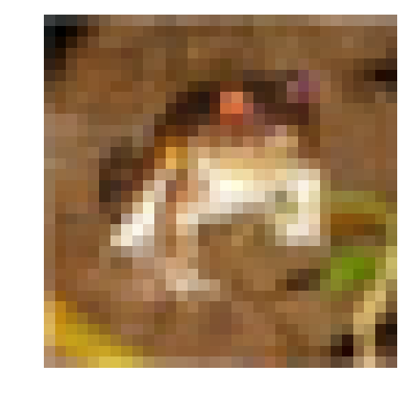


    
    Stats of batch 1:
    Samples: 10000
    Label Counts: {0: 1005, 1: 974, 2: 1032, 3: 1016, 4: 999, 5: 937, 6: 1030, 7: 1001, 8: 1025, 9: 981}
    First 20 Labels: [6, 9, 9, 4, 1, 1, 2, 7, 8, 3, 4, 7, 7, 2, 9, 9, 9, 3, 2, 6]
    
    Example of Image 1:
    Image - Min Value: 5 Max Value: 254
    Image - Shape: (32, 32, 3)
    Label - Label Id: 9 Name: truck


    
    Stats of batch 2:
    Samples: 10000
    Label Counts: {0: 984, 1: 1007, 2: 1010, 3: 995, 4: 1010, 5: 988, 6: 1008, 7: 1026, 8: 987, 9: 985}
    First 20 Labels: [1, 6, 6, 8, 8, 3, 4, 6, 0, 6, 0, 3, 6, 6, 5, 4, 8, 3, 2, 6]
    
    Example of Image 0:
    Image - Min Value: 5 Max Value: 225
    Image - Shape: (32, 32, 3)
    Label - Label Id: 1 Name: automobile


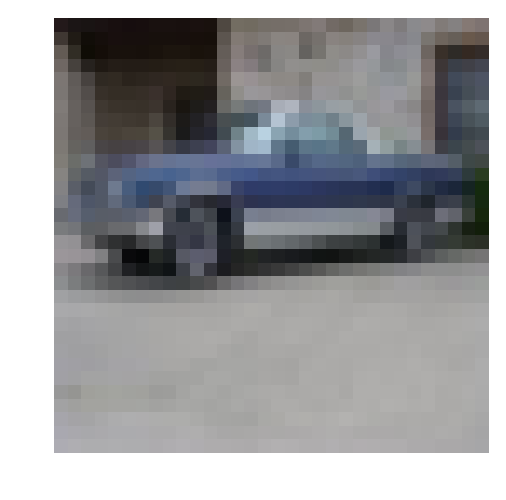


    
    Stats of batch 2:
    Samples: 10000
    Label Counts: {0: 984, 1: 1007, 2: 1010, 3: 995, 4: 1010, 5: 988, 6: 1008, 7: 1026, 8: 987, 9: 985}
    First 20 Labels: [1, 6, 6, 8, 8, 3, 4, 6, 0, 6, 0, 3, 6, 6, 5, 4, 8, 3, 2, 6]
    
    Example of Image 1:
    Image - Min Value: 2 Max Value: 247
    Image - Shape: (32, 32, 3)
    Label - Label Id: 6 Name: frog


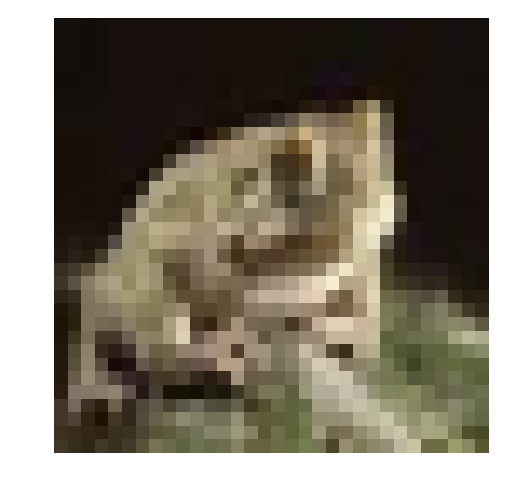


    
    Stats of batch 3:
    Samples: 10000
    Label Counts: {0: 994, 1: 1042, 2: 965, 3: 997, 4: 990, 5: 1029, 6: 978, 7: 1015, 8: 961, 9: 1029}
    First 20 Labels: [8, 5, 0, 6, 9, 2, 8, 3, 6, 2, 7, 4, 6, 9, 0, 0, 7, 3, 7, 2]
    
    Example of Image 0:
    Image - Min Value: 0 Max Value: 254
    Image - Shape: (32, 32, 3)
    Label - Label Id: 8 Name: ship


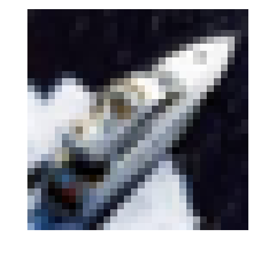


    
    Stats of batch 3:
    Samples: 10000
    Label Counts: {0: 994, 1: 1042, 2: 965, 3: 997, 4: 990, 5: 1029, 6: 978, 7: 1015, 8: 961, 9: 1029}
    First 20 Labels: [8, 5, 0, 6, 9, 2, 8, 3, 6, 2, 7, 4, 6, 9, 0, 0, 7, 3, 7, 2]
    
    Example of Image 1:
    Image - Min Value: 15 Max Value: 249
    Image - Shape: (32, 32, 3)
    Label - Label Id: 5 Name: dog


    
    Stats of batch 4:
    Samples: 10000
    Label Counts: {0: 1003, 1: 963, 2: 1041, 3: 976, 4: 1004, 5: 1021, 6: 1004, 7: 981, 8: 1024, 9: 983}
    First 20 Labels: [0, 6, 0, 2, 7, 2, 1, 2, 4, 1, 5, 6, 6, 3, 1, 3, 5, 5, 8, 1]
    
    Example of Image 0:
    Image - Min Value: 34 Max Value: 203
    Image - Shape: (32, 32, 3)
    Label - Label Id: 0 Name: airplane


    
    Stats of batch 4:
    Samples: 10000
    Label Counts: {0: 1003, 1: 963, 2: 1041, 3: 976, 4: 1004, 5: 1021, 6: 1004, 7: 981, 8: 1024, 9: 983}
    First 20 Labels: [0, 6, 0, 2, 7, 2, 1, 2, 4, 1, 5, 6, 6, 3, 1, 3, 5, 5, 8, 1]
    
    Example of Image 1:
    Image - Min Value: 0 Max Value: 246
    Image - Shape: (32, 32, 3)
    Label - Label Id: 6 Name: frog


    
    Stats of batch 5:
    Samples: 10000
    Label Counts: {0: 1014, 1: 1014, 2: 952, 3: 1016, 4: 997, 5: 1025, 6: 980, 7: 977, 8: 1003, 9: 1022}
    First 20 Labels: [1, 8, 5, 1, 5, 7, 4, 3, 8, 2, 7, 2, 0, 1, 5, 9, 6, 2, 0, 8]
    
    Example of Image 0:
    Image - Min Value: 2 Max Value: 255
    Image - Shape: (32, 32, 3)
    Label - Label Id: 1 Name: automobile


    
    Stats of batch 5:
    Samples: 10000
    Label Counts: {0: 1014, 1: 1014, 2: 952, 3: 1016, 4: 997, 5: 1025, 6: 980, 7: 977, 8: 1003, 9: 1022}
    First 20 Labels: [1, 8, 5, 1, 5, 7, 4, 3, 8, 2, 7, 2, 0, 1, 5, 9, 6, 2, 0, 8]
    
    Example of Image 1:
    Image - Min Value: 1 Max Value: 244
    Image - Shape: (32, 32, 3)
    Label - Label Id: 8 Name: ship


# Converting datasets to .tfrecord
Next we convert the datasets to tfrecords. This would allow for the easier further processing by Tensorflow. While the neural network constructed in [Convolutional neural network for image classification from scratch](http://machinememos.com/python/artificial%20intelligence/machine%20learning/cifar10/neural%20networks/convolutional%20neural%20network/dropout/image%20classification/2017/04/23/convolutional-neural-network-from-scratch.html) expected images with size 32x32, the CNN we are going to use here expects an input size of 299x299. Nevertheless, it is not necessary to convert all 60000 images to the target size of 299x299 as this would requre much more of your disk space. Converting the data to tfrecord would actually shrink the dataset size (lossless compression) and allow for the use of tensorflow's preprocessing pipeline and a dynamic conversion to the desired target size of 299x299 at training time.


```python
import sys
import dataset_utils
import tensorflow as tf

IMAGE_SIZE = 32
RGB_CHANNELS = 3

def add_to_tfrecord(filename, tfrecord_writer, offset=0):
    
    with open(filename, mode='rb') as f:
        data = pickle.load(f, encoding='latin1')
    
    images = data['data']
    num_images = images.shape[0]

    images = images.reshape((num_images, RGB_CHANNELS, IMAGE_SIZE, IMAGE_SIZE))
    labels = data['labels']

    with tf.Graph().as_default():
        image_placeholder = tf.placeholder(dtype=tf.uint8)
        encoded_image = tf.image.encode_png(image_placeholder)

        with tf.Session('') as sess:

            for j in range(num_images):
                sys.stdout.write('\r>> Reading file [%s] image %d/%d' % \
                    (filename, offset + j + 1, offset + num_images))
                sys.stdout.flush()

                image = np.squeeze(images[j]).transpose((1, 2, 0))
                label = labels[j]

                png_string = sess.run(encoded_image,\
                         feed_dict={image_placeholder: image})

                example = dataset_utils.image_to_tfexample(\
                    png_string, 'png'.encode('utf-8'), IMAGE_SIZE, IMAGE_SIZE, label)
                tfrecord_writer.write(example.SerializeToString())

    return offset + num_images


if not os.path.isdir('tfrecord'):
    # make the directory
    os.mkdir('tfrecord')
    # write all 5 batches into single training tfrecord
    with tf.python_io.TFRecordWriter(os.path.join('tfrecord', 'cifar-10-training-tfrecord')) as tfrecord_writer:
        offset = 0
        for i in range(1, 6): # Train batches are data_batch_1 ... data_batch_5
            filename = os.path.join('cifar-10-batches-py', 'data_batch_%d' % (i))
            offset = add_to_tfrecord(filename, tfrecord_writer, offset)

    # Next, process the testing data:
    with tf.python_io.TFRecordWriter(os.path.join('tfrecord', 'cifar-10-test-tfrecord')) as tfrecord_writer:
        filename = os.path.join('cifar-10-batches-py', 'test_batch')
        add_to_tfrecord(filename, tfrecord_writer)

    # Finally, write the labels file:
    labels_to_class_names = dict(zip(range(len(CLASS_NAMES)), CLASS_NAMES))

    with tf.gfile.Open(os.path.join('tfrecord', 'labels.txt'), 'w') as f:
        for label in labels_to_class_names:
            class_name = labels_to_class_names[label]
            f.write('%d:%s\n' % (label, class_name))
```

# Downloading GoogleLeNet
As previously elaborated, selecting a proper network to "finetune" is very important. For this post I chose GoogleLeNet and more specifically the InceptionV3 convolutional neural network. An overview on other fully trained neural networks by Google is available in the [Tensorflow Slim Project](https://github.com/tensorflow/models/tree/master/slim). All four versions of Inception (V1, V2, V3, v4) were trained on part of the [ImageNet](http://www.image-net.org/challenges/LSVRC/2012/) dataset, whick consists of more than 10,000,000 images and over 10,000 categories. The ten categories in Cifar-10 are covered in ImageNet to some extent. Hence, the Inception models should be capable of recognizing images from Cifar-10 after we apply some finetuning. For this post I chose InceptionV3. As a matter of fact, the latest Inception network - InceptionV4 deemed the best results when testet against [ImageNet](http://www.image-net.org/challenges/LSVRC/2012/). However, InceptionV4 is much larger than InceptionV3 und would require much more computational resources when finetuning. Therefore I selected the second best Inception i.e. InceptionV3. The remaining code could be very easily modified to use the other versions of Inception. Given you have time and several GPUs to your dispolsal, I would rather recommend InceptionV4. InceptionV1 is the smallest and very suitable for some proof-of-concept-like projects.


```python
inceptionv3_archive = os.path.join('model', 'inception_v3_2016_08_28.tar.gz')

class DLProgress(tqdm):
    last_block = 0

    def hook(self, block_num=1, block_size=1, total_size=None):
        self.total = total_size
        self.update((block_num - self.last_block) * block_size)
        self.last_block = block_num

if not os.path.isdir('model'):
    # create directory to store model
    os.mkdir('model')
    # download the model
    with DLProgress(unit='B', unit_scale=True, miniters=1, desc='InceptionV3') as pbar:
        urlretrieve(
            # I hope this url stays there
            'http://download.tensorflow.org/models/inception_v3_2016_08_28.tar.gz',
            inceptionv3_archive,
            pbar.hook)

    with tarfile.open(inceptionv3_archive) as tar:
        tar.extractall('model')
        tar.close()
```

### Finetuning InceptionV3
First we define a couple of functions for loading a batch and loading the dataset. 


```python
import inception_preprocessing

def load_batch(dataset, batch_size, height, width, is_training=False):
    data_provider = slim.dataset_data_provider.DatasetDataProvider(
        dataset, common_queue_capacity=32, common_queue_min=8)
    image_raw, label = data_provider.get(['image', 'label'])
    
    # Preprocess image for usage by Inception.
    image = inception_preprocessing.preprocess_image(
        image_raw, height, width, is_training=is_training)
    
    # Preprocess the image for display purposes.
    image_raw = tf.expand_dims(image_raw, 0)
    image_raw = tf.image.resize_images(image_raw, [height, width])
    image_raw = tf.squeeze(image_raw)

    # Batch it up.
    images, images_raw, labels = tf.train.batch(
          [image, image_raw, label],
          batch_size=batch_size,
          num_threads=1,
          capacity=2 * batch_size)
    
    return images, images_raw, labels

def get_dataset(dataset_file_name, train_sample_size):

    ITEMS_TO_DESCRIPTIONS = {
        'image': 'A [32 x 32 x 3] color image.',
        'label': 'A single integer between 0 and 9',
    }

    keys_to_features = {
          'image/encoded': tf.FixedLenFeature((), tf.string, default_value=''),
          'image/format': tf.FixedLenFeature((), tf.string, default_value='png'),
          'image/class/label': tf.FixedLenFeature(
              [], tf.int64, default_value=tf.zeros([], dtype=tf.int64)),
    }

    items_to_handlers = {
          'image': slim.tfexample_decoder.Image(shape=[IMAGE_SIZE, IMAGE_SIZE, 3]),
          'label': slim.tfexample_decoder.Tensor('image/class/label'),
    }

    labels_to_names = {}
    for i in range(0, len(CLASS_NAMES)):
        labels_to_names[i] = CLASS_NAMES[i]

    decoder = slim.tfexample_decoder.TFExampleDecoder(keys_to_features, items_to_handlers)

    return slim.dataset.Dataset(
          data_sources=dataset_file_name,
          reader=tf.TFRecordReader,
          decoder=decoder,
          num_samples=train_sample_size,
          items_to_descriptions=ITEMS_TO_DESCRIPTIONS,
          num_classes=len(CLASS_NAMES),
          labels_to_names=labels_to_names)
```

Next we define a function for loading the pretrained model that has been previously downloaded. The function also specifies which variables should be restored from the pretrained model. The actual layers of the neural network are contained in those varaibles. What does finetuning a network means? The process of "finetuning" is selecting layers from the nueral network that should be retrained through backpropagation, while leaving the other layers unchanged. In a neural network for image classification, early layers capture low level details. Each subsequent layer uses the lower level details from its predecessors (e.g. a nose, an eye and a mouth) to caputre a higher level detail (e.g. a dogs or cats face). Take a look at the picture below.

What Andrew Ng is showing in the [Deep Learning, Self-Taught Learning and Unsupervised Feature Learning](https://www.youtube.com/watch?v=n1ViNeWhC24) is how the level of abstraction is increasing with each subsequent layer of neurons. For more detailed explanation on this matter I can also recommend [Visualizing and Understanding Deep Neural Networks by Matt Zeiler](https://www.youtube.com/watch?v=ghEmQSxT6tw). Anyway, when finetuning you will only train the last few layers of the network. The functions below will not only load the model, but will also create a small log file. The log file [tf_inception_vars.txt](tf_inception variables.txt) shows all tensorflow variables and indicates which variables would remain unchanged and which would be retrained through backpropagation in the process of finetuning.


```python
def get_init_fn():
    """Returns a function run by the chief worker to warm-start the training."""
    checkpoint_exclude_scopes=["InceptionV3/Logits", "InceptionV3/AuxLogits", "InceptionV3/Mixed_7"]
    
    exclusions = [scope.strip() for scope in checkpoint_exclude_scopes]
    
    variables_to_restore = []
    variables_to_retrain = []
    
    for var in slim.get_model_variables():
        excluded = False
        for exclusion in exclusions:
            if var.op.name.startswith(exclusion):
                excluded = True
                break
        if not excluded:
            variables_to_restore.append(var)
        else:
            variables_to_retrain.append(var)
    
    with tf.gfile.Open('tf_inception_vars.txt', 'w') as f:
        for var in variables_to_restore:
             f.write('%s ::RESTORED FROM CHECKPOINT\n' % (var))
        for var in variables_to_retrain:
             f.write('%s ::SELECTED FOR RETRAINING\n' % (var))

    return slim.assign_from_checkpoint_fn(
      os.path.join('model','inception_v3.ckpt'), variables_to_restore)
```

Finally, we select several hyperparameters. A batch size of 128 pictures was a too much for the 12 GB of RAM I dedicated to my Linux VM. 64 was just fine. A single global step needed around 50 seconds. Hence, 1500 steps is around a day of time. If you have a CUDA-capable NVIDIA GPU the training will be much faster. The learning rate is probably the most importat hyperparameter. If you choose a learning rate too high, your model will converge very fast without actually learning anything. If you choose a learning rate too low, your model will train just fine, but you may not live long enough to see it finally converged. The Adam Optimizer is the least sensitive Optimizer I have tried out. For this tutorial I started with a learning rate of 0.01 and only after 15 steps (10 min of training) I noticed that the loss does not decrease. A learning rate of 0.001 was just fine. I like the AdamOptimizer as it is very tolerant if you chose a learning rate too high. You can also check this [excellent overview on different optimizers](http://sebastianruder.com/optimizing-gradient-descent/index.html#adam). 


```python
from inception_v3 import inception_v3
from inception_v3 import inception_v3_arg_scope

TRAIN_SAMPLES = 50000
INCEPTION_IMAGE_SIZE = 299
BATCH_SIZE = 64
NUMBER_OF_STEPS = 1500
LEARNING_RATE = 0.001

slim = tf.contrib.slim

TRAINED_MODEL_DIR = 'inceptionV3_cifar10_finetuned'

with tf.Graph().as_default():
    tf.logging.set_verbosity(tf.logging.INFO)
    
    train_dataset = get_dataset(
        os.path.join('tfrecord','cifar-10-training-tfrecord'), TRAIN_SAMPLES)
    
    images, _, labels = load_batch(
       train_dataset, BATCH_SIZE, INCEPTION_IMAGE_SIZE, INCEPTION_IMAGE_SIZE)
    
    # Create the model, use the default arg scope to configure the batch norm parameters.
    with slim.arg_scope(inception_v3_arg_scope()):
        logits, _ = inception_v3(images, num_classes=train_dataset.num_classes, is_training=True)
        
    # Specify the loss function:
    one_hot_labels = slim.one_hot_encoding(labels, train_dataset.num_classes)
    slim.losses.softmax_cross_entropy(logits, one_hot_labels)
    total_loss = slim.losses.get_total_loss()

    # Create some summaries to visualize the training process:
    tf.summary.scalar('losses/Total Loss', total_loss)
  
    # Specify the optimizer and create the train op:
    optimizer = tf.train.AdamOptimizer(learning_rate=LEARNING_RATE)
    train_op = slim.learning.create_train_op(total_loss, optimizer)
    
    # Run the training:
    final_loss = slim.learning.train(
        train_op,
        logdir=TRAINED_MODEL_DIR,
        init_fn=get_init_fn(),
        number_of_steps=NUMBER_OF_STEPS)
        
print('Finished training. Last batch loss %f' % final_loss)
```

    WARNING:tensorflow:From <ipython-input-8-ed783d386345>:28: softmax_cross_entropy (from tensorflow.contrib.losses.python.losses.loss_ops) is deprecated and will be removed after 2016-12-30.
    Instructions for updating:
    Use tf.losses.softmax_cross_entropy instead.
    WARNING:tensorflow:From /home/freeman/anaconda3/envs/machinelearning/lib/python3.5/site-packages/tensorflow/contrib/losses/python/losses/loss_ops.py:394: compute_weighted_loss (from tensorflow.contrib.losses.python.losses.loss_ops) is deprecated and will be removed after 2016-12-30.
    Instructions for updating:
    Use tf.losses.compute_weighted_loss instead.
    WARNING:tensorflow:From /home/freeman/anaconda3/envs/machinelearning/lib/python3.5/site-packages/tensorflow/contrib/losses/python/losses/loss_ops.py:151: add_loss (from tensorflow.contrib.losses.python.losses.loss_ops) is deprecated and will be removed after 2016-12-30.
    Instructions for updating:
    Use tf.losses.add_loss instead.
    WARNING:tensorflow:From <ipython-input-8-ed783d386345>:29: get_total_loss (from tensorflow.contrib.losses.python.losses.loss_ops) is deprecated and will be removed after 2016-12-30.
    Instructions for updating:
    Use tf.losses.get_total_loss instead.
    WARNING:tensorflow:From /home/freeman/anaconda3/envs/machinelearning/lib/python3.5/site-packages/tensorflow/contrib/losses/python/losses/loss_ops.py:261: get_losses (from tensorflow.contrib.losses.python.losses.loss_ops) is deprecated and will be removed after 2016-12-30.
    Instructions for updating:
    Use tf.losses.get_losses instead.
    WARNING:tensorflow:From /home/freeman/anaconda3/envs/machinelearning/lib/python3.5/site-packages/tensorflow/contrib/losses/python/losses/loss_ops.py:263: get_regularization_losses (from tensorflow.contrib.losses.python.losses.loss_ops) is deprecated and will be removed after 2016-12-30.
    Instructions for updating:
    Use tf.losses.get_regularization_losses instead.
    INFO:tensorflow:Summary name losses/Total Loss is illegal; using losses/Total_Loss instead.
    INFO:tensorflow:Starting Session.
    INFO:tensorflow:Starting Queues.
    INFO:tensorflow:global_step/sec: 0
    INFO:tensorflow:global step 1: loss = 2.9792 (76.37 sec/step)
    INFO:tensorflow:global step 2: loss = 2.4563 (52.38 sec/step)
    INFO:tensorflow:global step 3: loss = 1.8246 (51.16 sec/step)
    INFO:tensorflow:global step 4: loss = 1.9932 (51.35 sec/step)
    INFO:tensorflow:global step 5: loss = 1.8377 (49.80 sec/step)
    INFO:tensorflow:global step 6: loss = 1.7817 (50.04 sec/step)
    INFO:tensorflow:global step 7: loss = 1.6296 (51.05 sec/step)
    INFO:tensorflow:global step 8: loss = 2.2302 (50.08 sec/step)
    INFO:tensorflow:global step 9: loss = 1.6774 (50.25 sec/step)
    INFO:tensorflow:global step 10: loss = 2.3420 (50.18 sec/step)
    INFO:tensorflow:global step 11: loss = 2.4664 (50.35 sec/step)
    INFO:tensorflow:global_step/sec: 0.018332
    INFO:tensorflow:global step 12: loss = 2.5359 (138.44 sec/step)
    INFO:tensorflow:global step 13: loss = 1.7861 (53.38 sec/step)
    INFO:tensorflow:global step 14: loss = 1.8678 (50.45 sec/step)
    INFO:tensorflow:global step 15: loss = 1.7813 (50.95 sec/step)
    INFO:tensorflow:global step 16: loss = 1.8705 (51.96 sec/step)
    INFO:tensorflow:global step 17: loss = 2.0948 (52.28 sec/step)
    INFO:tensorflow:global step 18: loss = 1.9060 (50.95 sec/step)
    INFO:tensorflow:global step 19: loss = 2.2172 (51.05 sec/step)
    INFO:tensorflow:global step 20: loss = 2.1335 (51.86 sec/step)
    INFO:tensorflow:global step 21: loss = 1.8000 (50.78 sec/step)
    INFO:tensorflow:global_step/sec: 0.0166739
    INFO:tensorflow:global step 22: loss = 1.9881 (97.99 sec/step)
    INFO:tensorflow:global step 23: loss = 1.7981 (52.78 sec/step)
    INFO:tensorflow:global step 24: loss = 1.4835 (50.32 sec/step)
    INFO:tensorflow:global step 25: loss = 1.8737 (50.29 sec/step)
    INFO:tensorflow:global step 26: loss = 1.7486 (50.08 sec/step)
    INFO:tensorflow:global step 27: loss = 1.9469 (50.89 sec/step)
    INFO:tensorflow:global step 28: loss = 1.6038 (50.68 sec/step)
    INFO:tensorflow:global step 29: loss = 1.7697 (50.29 sec/step)
    INFO:tensorflow:global step 30: loss = 1.5770 (50.11 sec/step)
    INFO:tensorflow:global step 31: loss = 1.7065 (50.02 sec/step)
    INFO:tensorflow:global step 32: loss = 1.6302 (50.13 sec/step)
    INFO:tensorflow:global_step/sec: 0.0183341
    INFO:tensorflow:global step 33: loss = 1.5249 (72.90 sec/step)
    INFO:tensorflow:global step 34: loss = 1.6261 (52.58 sec/step)
    INFO:tensorflow:global step 35: loss = 1.4220 (51.99 sec/step)
    INFO:tensorflow:global step 36: loss = 1.6246 (50.44 sec/step)
    INFO:tensorflow:global step 37: loss = 1.4762 (50.53 sec/step)
    INFO:tensorflow:global step 38: loss = 1.1884 (49.94 sec/step)
    INFO:tensorflow:global step 39: loss = 1.5453 (50.53 sec/step)
    INFO:tensorflow:global step 40: loss = 1.2753 (50.65 sec/step)
    INFO:tensorflow:global step 41: loss = 1.4121 (56.39 sec/step)
    INFO:tensorflow:global step 42: loss = 1.3980 (53.92 sec/step)
    INFO:tensorflow:global step 43: loss = 1.8281 (51.49 sec/step)
    INFO:tensorflow:global_step/sec: 0.0183329
    INFO:tensorflow:global step 44: loss = 1.5707 (165.34 sec/step)
    INFO:tensorflow:global step 45: loss = 1.5222 (51.59 sec/step)
    INFO:tensorflow:global step 46: loss = 1.6773 (50.20 sec/step)
    INFO:tensorflow:global step 47: loss = 1.3396 (50.63 sec/step)
    INFO:tensorflow:global step 48: loss = 1.5202 (50.29 sec/step)
    INFO:tensorflow:global step 49: loss = 1.6970 (50.57 sec/step)
    INFO:tensorflow:global step 50: loss = 1.4276 (119.94 sec/step)
    INFO:tensorflow:global step 51: loss = 1.4830 (50.19 sec/step)
    INFO:tensorflow:global_step/sec: 0.0133336
    INFO:tensorflow:global step 52: loss = 1.5955 (87.74 sec/step)
    INFO:tensorflow:global step 53: loss = 1.3350 (54.56 sec/step)
    INFO:tensorflow:global step 54: loss = 1.3499 (50.24 sec/step)
    INFO:tensorflow:global step 55: loss = 1.5600 (50.38 sec/step)
    INFO:tensorflow:global step 56: loss = 1.6851 (51.38 sec/step)
    INFO:tensorflow:global step 57: loss = 1.4873 (50.28 sec/step)
    INFO:tensorflow:global step 58: loss = 1.3751 (49.99 sec/step)
    INFO:tensorflow:global step 59: loss = 1.4351 (51.44 sec/step)
    INFO:tensorflow:global step 60: loss = 1.5932 (51.48 sec/step)
    INFO:tensorflow:global step 61: loss = 1.3398 (53.21 sec/step)
    INFO:tensorflow:global step 62: loss = 1.3294 (50.47 sec/step)
    INFO:tensorflow:global_step/sec: 0.0183333
    INFO:tensorflow:global step 63: loss = 1.0910 (175.36 sec/step)
    INFO:tensorflow:global step 64: loss = 1.4571 (123.69 sec/step)
    INFO:tensorflow:global step 65: loss = 1.3450 (50.53 sec/step)
    INFO:tensorflow:global step 66: loss = 1.3475 (49.99 sec/step)
    INFO:tensorflow:global step 67: loss = 1.2378 (50.68 sec/step)
    INFO:tensorflow:global step 68: loss = 1.0779 (53.38 sec/step)
    INFO:tensorflow:global step 69: loss = 1.4500 (50.61 sec/step)
    INFO:tensorflow:global step 70: loss = 1.6547 (50.22 sec/step)
    INFO:tensorflow:global_step/sec: 0.0133334
    INFO:tensorflow:global step 71: loss = 1.7048 (208.15 sec/step)
    INFO:tensorflow:global step 72: loss = 1.4994 (53.71 sec/step)
    INFO:tensorflow:global step 73: loss = 1.4956 (52.21 sec/step)
    INFO:tensorflow:global step 74: loss = 1.3198 (51.09 sec/step)
    INFO:tensorflow:global step 75: loss = 1.3537 (51.15 sec/step)
    INFO:tensorflow:global step 76: loss = 1.5494 (52.36 sec/step)
    INFO:tensorflow:global step 77: loss = 1.3594 (50.06 sec/step)
    INFO:tensorflow:global step 78: loss = 1.4364 (50.10 sec/step)
    INFO:tensorflow:global step 79: loss = 1.6443 (50.25 sec/step)
    INFO:tensorflow:global_step/sec: 0.015
    INFO:tensorflow:global step 80: loss = 1.3197 (153.64 sec/step)
    INFO:tensorflow:global step 81: loss = 1.3230 (57.26 sec/step)
    INFO:tensorflow:global step 82: loss = 1.5363 (50.73 sec/step)
    INFO:tensorflow:global step 83: loss = 1.5049 (50.64 sec/step)
    INFO:tensorflow:global step 84: loss = 1.3675 (50.02 sec/step)
    INFO:tensorflow:global step 85: loss = 1.4941 (50.56 sec/step)
    INFO:tensorflow:global step 86: loss = 1.2213 (50.53 sec/step)
    INFO:tensorflow:global step 87: loss = 1.1753 (50.01 sec/step)
    INFO:tensorflow:global step 88: loss = 1.3159 (50.03 sec/step)
    INFO:tensorflow:global_step/sec: 0.0149999
    INFO:tensorflow:global step 89: loss = 1.3677 (67.93 sec/step)
    INFO:tensorflow:global step 90: loss = 1.2768 (93.80 sec/step)
    INFO:tensorflow:global step 91: loss = 1.1625 (50.98 sec/step)
    INFO:tensorflow:global step 92: loss = 1.4313 (50.41 sec/step)
    INFO:tensorflow:global step 93: loss = 1.2813 (50.69 sec/step)
    INFO:tensorflow:global step 94: loss = 1.3298 (50.36 sec/step)
    INFO:tensorflow:global step 95: loss = 1.2124 (50.56 sec/step)
    INFO:tensorflow:global step 96: loss = 1.3203 (50.37 sec/step)
    INFO:tensorflow:global step 97: loss = 1.3482 (50.53 sec/step)
    INFO:tensorflow:global step 98: loss = 1.3757 (50.03 sec/step)
    INFO:tensorflow:global step 99: loss = 1.1161 (49.96 sec/step)
    INFO:tensorflow:global step 100: loss = 1.0947 (193.74 sec/step)
    INFO:tensorflow:global step 101: loss = 1.3144 (53.28 sec/step)
    INFO:tensorflow:global step 102: loss = 1.1759 (49.93 sec/step)
    INFO:tensorflow:global step 103: loss = 1.0648 (50.19 sec/step)
    INFO:tensorflow:global step 104: loss = 1.1484 (50.69 sec/step)
    INFO:tensorflow:global step 105: loss = 1.4195 (50.32 sec/step)
    INFO:tensorflow:global step 106: loss = 1.1781 (50.82 sec/step)
    INFO:tensorflow:global step 107: loss = 1.5032 (50.18 sec/step)
    INFO:tensorflow:global step 108: loss = 1.6103 (50.64 sec/step)
    INFO:tensorflow:global step 109: loss = 1.2823 (142.71 sec/step)
    INFO:tensorflow:global step 110: loss = 1.0068 (53.86 sec/step)
    INFO:tensorflow:global step 111: loss = 1.2906 (50.01 sec/step)
    INFO:tensorflow:global step 112: loss = 1.1915 (50.98 sec/step)
    INFO:tensorflow:global step 113: loss = 1.6228 (50.40 sec/step)
    INFO:tensorflow:global step 114: loss = 1.3579 (50.84 sec/step)
    INFO:tensorflow:global step 115: loss = 1.0796 (50.16 sec/step)
    INFO:tensorflow:global step 116: loss = 1.2476 (51.37 sec/step)
    INFO:tensorflow:global step 117: loss = 1.3301 (50.18 sec/step)
    INFO:tensorflow:global step 118: loss = 1.5913 (50.14 sec/step)
    INFO:tensorflow:global step 119: loss = 1.1278 (154.64 sec/step)
    INFO:tensorflow:global step 120: loss = 1.3826 (53.15 sec/step)
    INFO:tensorflow:global step 121: loss = 1.2235 (50.89 sec/step)
    INFO:tensorflow:global step 122: loss = 1.2099 (50.58 sec/step)
    INFO:tensorflow:global step 123: loss = 1.1951 (50.04 sec/step)
    INFO:tensorflow:global step 124: loss = 1.2342 (50.61 sec/step)
    INFO:tensorflow:global step 125: loss = 1.3754 (50.68 sec/step)
    INFO:tensorflow:global step 126: loss = 1.1504 (50.77 sec/step)
    INFO:tensorflow:global step 127: loss = 1.2650 (50.11 sec/step)
    INFO:tensorflow:global step 128: loss = 1.2746 (49.98 sec/step)
    INFO:tensorflow:global step 129: loss = 1.3509 (214.96 sec/step)
    INFO:tensorflow:global step 130: loss = 1.2852 (51.53 sec/step)
    INFO:tensorflow:global step 131: loss = 1.1748 (50.96 sec/step)
    INFO:tensorflow:global step 132: loss = 1.3777 (50.58 sec/step)
    INFO:tensorflow:global step 133: loss = 1.1877 (50.70 sec/step)
    INFO:tensorflow:global step 134: loss = 1.2937 (50.72 sec/step)
    INFO:tensorflow:global step 135: loss = 1.1880 (60.26 sec/step)
    INFO:tensorflow:global step 136: loss = 1.1520 (58.28 sec/step)
    INFO:tensorflow:global step 137: loss = 1.0974 (95.05 sec/step)
    INFO:tensorflow:global step 138: loss = 1.1378 (53.77 sec/step)
    INFO:tensorflow:global step 139: loss = 1.2518 (51.18 sec/step)
    INFO:tensorflow:global step 140: loss = 1.2432 (50.16 sec/step)
    INFO:tensorflow:global step 141: loss = 1.2001 (51.53 sec/step)
    INFO:tensorflow:global step 142: loss = 1.0792 (50.89 sec/step)
    INFO:tensorflow:global step 143: loss = 1.4197 (50.82 sec/step)
    INFO:tensorflow:global step 144: loss = 1.2773 (50.51 sec/step)
    INFO:tensorflow:global step 145: loss = 1.1925 (50.62 sec/step)
    INFO:tensorflow:global step 146: loss = 1.0616 (51.49 sec/step)
    INFO:tensorflow:global step 147: loss = 1.6520 (56.18 sec/step)
    INFO:tensorflow:global step 148: loss = 1.2212 (222.74 sec/step)
    INFO:tensorflow:global step 149: loss = 1.5574 (52.79 sec/step)
    INFO:tensorflow:global step 150: loss = 1.0980 (49.91 sec/step)
    INFO:tensorflow:global step 151: loss = 1.2402 (50.83 sec/step)
    INFO:tensorflow:global step 152: loss = 1.2601 (50.51 sec/step)
    INFO:tensorflow:global step 153: loss = 1.2488 (50.81 sec/step)
    INFO:tensorflow:global step 154: loss = 1.1590 (51.05 sec/step)
    INFO:tensorflow:global step 155: loss = 1.2306 (50.69 sec/step)
    INFO:tensorflow:global step 156: loss = 1.4294 (102.77 sec/step)
    INFO:tensorflow:global step 157: loss = 1.2642 (59.88 sec/step)
    INFO:tensorflow:global step 158: loss = 1.2963 (51.38 sec/step)
    INFO:tensorflow:global step 159: loss = 1.1104 (51.56 sec/step)
    INFO:tensorflow:global step 160: loss = 1.1227 (51.43 sec/step)
    INFO:tensorflow:global step 161: loss = 1.2187 (50.42 sec/step)
    INFO:tensorflow:global step 162: loss = 1.3510 (50.87 sec/step)
    INFO:tensorflow:global step 163: loss = 1.0206 (51.09 sec/step)
    INFO:tensorflow:global step 164: loss = 1.1333 (50.30 sec/step)
    INFO:tensorflow:global step 165: loss = 1.2278 (51.56 sec/step)
    INFO:tensorflow:global step 166: loss = 1.2407 (50.62 sec/step)
    INFO:tensorflow:global step 167: loss = 1.2485 (185.96 sec/step)
    INFO:tensorflow:global step 168: loss = 1.3468 (50.70 sec/step)
    INFO:tensorflow:global step 169: loss = 1.1673 (50.86 sec/step)
    INFO:tensorflow:global step 170: loss = 1.2819 (53.88 sec/step)
    INFO:tensorflow:global step 171: loss = 0.9143 (63.68 sec/step)
    INFO:tensorflow:global step 172: loss = 1.1265 (52.14 sec/step)
    INFO:tensorflow:global step 173: loss = 1.0167 (52.29 sec/step)
    INFO:tensorflow:global step 174: loss = 1.1335 (56.49 sec/step)
    INFO:tensorflow:global step 175: loss = 1.2634 (65.04 sec/step)
    INFO:tensorflow:global step 176: loss = 1.6894 (132.10 sec/step)
    INFO:tensorflow:global step 177: loss = 1.1489 (55.07 sec/step)
    INFO:tensorflow:global step 178: loss = 1.3055 (50.23 sec/step)
    INFO:tensorflow:global step 179: loss = 1.1388 (49.92 sec/step)
    INFO:tensorflow:global step 180: loss = 1.2256 (59.73 sec/step)
    INFO:tensorflow:global step 181: loss = 1.2429 (49.66 sec/step)
    INFO:tensorflow:global step 182: loss = 1.0655 (50.49 sec/step)
    INFO:tensorflow:global step 183: loss = 1.1473 (50.69 sec/step)
    INFO:tensorflow:global step 184: loss = 1.2523 (50.44 sec/step)
    INFO:tensorflow:global step 185: loss = 1.2199 (134.39 sec/step)
    INFO:tensorflow:global step 186: loss = 0.9889 (62.98 sec/step)
    INFO:tensorflow:global step 187: loss = 1.1578 (50.54 sec/step)
    INFO:tensorflow:global step 188: loss = 1.6725 (50.15 sec/step)
    INFO:tensorflow:global step 189: loss = 0.9607 (50.57 sec/step)
    INFO:tensorflow:global step 190: loss = 1.4303 (50.85 sec/step)
    INFO:tensorflow:global step 191: loss = 1.2471 (51.23 sec/step)
    INFO:tensorflow:global step 192: loss = 1.1403 (50.91 sec/step)
    INFO:tensorflow:global step 193: loss = 1.3272 (51.16 sec/step)
    INFO:tensorflow:global step 194: loss = 1.2366 (50.90 sec/step)
    INFO:tensorflow:global step 195: loss = 1.1399 (194.55 sec/step)
    INFO:tensorflow:global step 196: loss = 1.1952 (52.50 sec/step)
    INFO:tensorflow:global step 197: loss = 1.1346 (51.12 sec/step)
    INFO:tensorflow:global step 198: loss = 1.2033 (50.80 sec/step)
    INFO:tensorflow:global step 199: loss = 0.9969 (50.77 sec/step)
    INFO:tensorflow:global step 200: loss = 1.2428 (50.68 sec/step)
    INFO:tensorflow:global step 201: loss = 1.2281 (50.50 sec/step)
    INFO:tensorflow:global step 202: loss = 1.1641 (50.66 sec/step)
    INFO:tensorflow:global step 203: loss = 1.1470 (52.98 sec/step)
    INFO:tensorflow:global step 204: loss = 1.0964 (176.50 sec/step)
    INFO:tensorflow:global step 205: loss = 1.0722 (52.83 sec/step)
    INFO:tensorflow:global step 206: loss = 1.1365 (51.93 sec/step)
    INFO:tensorflow:global step 207: loss = 1.2760 (51.69 sec/step)
    INFO:tensorflow:global step 208: loss = 1.1308 (51.04 sec/step)
    INFO:tensorflow:global step 209: loss = 1.1178 (51.16 sec/step)
    INFO:tensorflow:global step 210: loss = 0.9931 (51.29 sec/step)
    INFO:tensorflow:global step 211: loss = 1.1309 (51.04 sec/step)
    INFO:tensorflow:global step 212: loss = 1.4148 (51.70 sec/step)
    INFO:tensorflow:global step 213: loss = 1.2517 (95.48 sec/step)
    INFO:tensorflow:global step 214: loss = 0.9093 (72.23 sec/step)
    INFO:tensorflow:global step 215: loss = 1.3028 (50.54 sec/step)
    INFO:tensorflow:global step 216: loss = 1.1747 (51.09 sec/step)
    INFO:tensorflow:global step 217: loss = 1.1253 (50.94 sec/step)
    INFO:tensorflow:global step 218: loss = 1.2006 (50.25 sec/step)
    INFO:tensorflow:global step 219: loss = 1.2843 (50.88 sec/step)
    INFO:tensorflow:global step 220: loss = 1.0949 (51.25 sec/step)
    INFO:tensorflow:global step 221: loss = 1.1630 (51.84 sec/step)
    INFO:tensorflow:global step 222: loss = 1.0845 (50.83 sec/step)
    INFO:tensorflow:global step 223: loss = 1.5088 (51.40 sec/step)
    INFO:tensorflow:global step 224: loss = 1.0180 (120.81 sec/step)
    INFO:tensorflow:global step 225: loss = 0.9089 (53.01 sec/step)
    INFO:tensorflow:global step 226: loss = 1.4141 (50.88 sec/step)
    INFO:tensorflow:global step 227: loss = 1.2149 (51.12 sec/step)
    INFO:tensorflow:global step 228: loss = 1.0089 (50.87 sec/step)
    INFO:tensorflow:global step 229: loss = 1.1459 (53.06 sec/step)
    INFO:tensorflow:global step 230: loss = 1.1048 (51.08 sec/step)
    INFO:tensorflow:global step 231: loss = 1.0907 (51.36 sec/step)
    INFO:tensorflow:global step 232: loss = 1.1100 (50.75 sec/step)
    INFO:tensorflow:global step 233: loss = 1.3446 (51.89 sec/step)
    INFO:tensorflow:global step 234: loss = 1.1326 (155.40 sec/step)
    INFO:tensorflow:global step 235: loss = 1.1287 (53.51 sec/step)
    INFO:tensorflow:global step 236: loss = 1.0783 (51.54 sec/step)
    INFO:tensorflow:global step 237: loss = 0.9087 (50.85 sec/step)
    INFO:tensorflow:global step 238: loss = 1.0523 (51.33 sec/step)
    INFO:tensorflow:global step 239: loss = 1.1708 (50.77 sec/step)
    INFO:tensorflow:global step 240: loss = 1.1794 (50.90 sec/step)
    INFO:tensorflow:global step 241: loss = 1.1241 (51.16 sec/step)
    INFO:tensorflow:global step 242: loss = 0.9997 (50.58 sec/step)
    INFO:tensorflow:global step 243: loss = 0.9751 (51.47 sec/step)
    INFO:tensorflow:global step 244: loss = 1.2869 (128.65 sec/step)
    INFO:tensorflow:global step 245: loss = 1.1058 (52.00 sec/step)
    INFO:tensorflow:global step 246: loss = 1.4072 (50.88 sec/step)
    INFO:tensorflow:global step 247: loss = 0.9683 (51.44 sec/step)
    INFO:tensorflow:global step 248: loss = 1.0572 (50.85 sec/step)
    INFO:tensorflow:global step 249: loss = 0.9748 (50.95 sec/step)
    INFO:tensorflow:global step 250: loss = 1.0510 (51.47 sec/step)
    INFO:tensorflow:global step 251: loss = 1.0875 (50.94 sec/step)
    INFO:tensorflow:global step 252: loss = 1.1038 (51.17 sec/step)
    INFO:tensorflow:global step 253: loss = 1.2904 (51.68 sec/step)
    INFO:tensorflow:global step 254: loss = 1.2808 (198.09 sec/step)
    INFO:tensorflow:global step 255: loss = 1.0473 (52.03 sec/step)
    INFO:tensorflow:global step 256: loss = 1.1751 (50.70 sec/step)
    INFO:tensorflow:global step 257: loss = 1.1241 (51.22 sec/step)
    INFO:tensorflow:global step 258: loss = 1.1211 (51.31 sec/step)
    INFO:tensorflow:global step 259: loss = 1.4086 (50.54 sec/step)
    INFO:tensorflow:global step 260: loss = 0.9375 (50.81 sec/step)
    INFO:tensorflow:global step 261: loss = 1.2789 (51.46 sec/step)
    INFO:tensorflow:global step 262: loss = 1.2944 (52.06 sec/step)
    INFO:tensorflow:global step 263: loss = 1.2185 (162.98 sec/step)
    INFO:tensorflow:global step 264: loss = 1.1489 (52.77 sec/step)
    INFO:tensorflow:global step 265: loss = 1.0840 (51.38 sec/step)
    INFO:tensorflow:global step 266: loss = 1.0396 (51.89 sec/step)
    INFO:tensorflow:global step 267: loss = 0.8589 (50.88 sec/step)
    INFO:tensorflow:global step 268: loss = 0.9638 (50.59 sec/step)
    INFO:tensorflow:global step 269: loss = 1.1535 (51.56 sec/step)
    INFO:tensorflow:global step 270: loss = 1.0429 (51.32 sec/step)
    INFO:tensorflow:global step 271: loss = 1.0939 (51.43 sec/step)
    INFO:tensorflow:global step 272: loss = 1.5396 (140.15 sec/step)
    INFO:tensorflow:global step 273: loss = 1.0688 (61.42 sec/step)
    INFO:tensorflow:global step 274: loss = 0.8872 (51.46 sec/step)
    INFO:tensorflow:global step 275: loss = 1.1226 (51.01 sec/step)
    INFO:tensorflow:global step 276: loss = 0.9928 (51.21 sec/step)
    INFO:tensorflow:global step 277: loss = 1.1877 (51.65 sec/step)
    INFO:tensorflow:global step 278: loss = 0.9730 (51.17 sec/step)
    INFO:tensorflow:global step 279: loss = 1.1382 (51.26 sec/step)
    INFO:tensorflow:global step 280: loss = 1.2078 (51.30 sec/step)
    INFO:tensorflow:global step 281: loss = 1.0298 (51.15 sec/step)
    INFO:tensorflow:global step 282: loss = 1.1080 (277.95 sec/step)
    INFO:tensorflow:global step 283: loss = 1.0972 (52.00 sec/step)
    INFO:tensorflow:global step 284: loss = 1.0826 (51.65 sec/step)
    INFO:tensorflow:global step 285: loss = 1.0729 (52.10 sec/step)
    INFO:tensorflow:global step 286: loss = 1.1224 (51.07 sec/step)
    INFO:tensorflow:global step 287: loss = 1.1601 (51.82 sec/step)
    INFO:tensorflow:global step 288: loss = 1.0274 (50.77 sec/step)
    INFO:tensorflow:global step 289: loss = 1.0379 (158.15 sec/step)
    INFO:tensorflow:global step 290: loss = 1.0535 (57.11 sec/step)
    INFO:tensorflow:global step 291: loss = 1.0237 (51.07 sec/step)
    INFO:tensorflow:global step 292: loss = 1.1581 (51.39 sec/step)
    INFO:tensorflow:global step 293: loss = 1.0034 (50.78 sec/step)
    INFO:tensorflow:global step 294: loss = 1.2110 (51.98 sec/step)
    INFO:tensorflow:global step 295: loss = 0.9862 (51.99 sec/step)
    INFO:tensorflow:global step 296: loss = 0.8134 (51.47 sec/step)
    INFO:tensorflow:global step 297: loss = 0.8326 (51.77 sec/step)
    INFO:tensorflow:global step 298: loss = 1.1659 (52.27 sec/step)
    INFO:tensorflow:global step 299: loss = 0.9215 (138.41 sec/step)
    INFO:tensorflow:global step 300: loss = 1.1627 (52.26 sec/step)
    INFO:tensorflow:global step 301: loss = 1.1739 (52.01 sec/step)
    INFO:tensorflow:global step 302: loss = 1.1432 (51.49 sec/step)
    INFO:tensorflow:global step 303: loss = 1.2313 (51.56 sec/step)
    INFO:tensorflow:global step 304: loss = 1.2733 (51.45 sec/step)
    INFO:tensorflow:global step 305: loss = 1.2104 (51.98 sec/step)
    INFO:tensorflow:global step 306: loss = 1.2105 (51.82 sec/step)
    INFO:tensorflow:global step 307: loss = 0.8949 (53.11 sec/step)
    INFO:tensorflow:global step 308: loss = 1.2730 (57.92 sec/step)
    INFO:tensorflow:global step 309: loss = 0.9811 (117.16 sec/step)
    INFO:tensorflow:global step 310: loss = 1.1051 (52.32 sec/step)
    INFO:tensorflow:global step 311: loss = 1.1008 (51.78 sec/step)
    INFO:tensorflow:global step 312: loss = 1.2391 (51.84 sec/step)
    INFO:tensorflow:global step 313: loss = 1.0387 (51.96 sec/step)
    INFO:tensorflow:global step 314: loss = 1.1293 (52.01 sec/step)
    INFO:tensorflow:global step 315: loss = 1.2099 (53.81 sec/step)
    INFO:tensorflow:global step 316: loss = 0.9036 (54.72 sec/step)
    INFO:tensorflow:global step 317: loss = 1.0198 (56.35 sec/step)
    INFO:tensorflow:global step 318: loss = 1.2397 (57.25 sec/step)
    INFO:tensorflow:global step 319: loss = 1.0054 (146.18 sec/step)
    INFO:tensorflow:global step 320: loss = 1.1788 (52.93 sec/step)
    INFO:tensorflow:global step 321: loss = 1.0349 (51.79 sec/step)
    INFO:tensorflow:global step 322: loss = 1.3015 (51.40 sec/step)
    INFO:tensorflow:global step 323: loss = 1.1379 (51.52 sec/step)
    INFO:tensorflow:global step 324: loss = 1.2573 (52.02 sec/step)
    INFO:tensorflow:global step 325: loss = 1.0643 (52.59 sec/step)
    INFO:tensorflow:global step 326: loss = 1.0031 (52.22 sec/step)
    INFO:tensorflow:global step 327: loss = 0.9664 (52.95 sec/step)
    INFO:tensorflow:global step 328: loss = 0.9917 (165.68 sec/step)
    INFO:tensorflow:global step 329: loss = 0.9227 (54.67 sec/step)
    INFO:tensorflow:global step 330: loss = 1.0953 (51.04 sec/step)
    INFO:tensorflow:global step 331: loss = 1.0142 (51.77 sec/step)
    INFO:tensorflow:global step 332: loss = 1.0304 (51.33 sec/step)
    INFO:tensorflow:global step 333: loss = 1.1891 (51.63 sec/step)
    INFO:tensorflow:global step 334: loss = 0.9650 (51.79 sec/step)
    INFO:tensorflow:global step 335: loss = 0.9990 (51.89 sec/step)
    INFO:tensorflow:global step 336: loss = 0.8771 (51.96 sec/step)
    INFO:tensorflow:global step 337: loss = 1.2488 (62.78 sec/step)
    INFO:tensorflow:global step 338: loss = 1.2685 (85.49 sec/step)
    INFO:tensorflow:global step 339: loss = 0.9972 (52.21 sec/step)
    INFO:tensorflow:global step 340: loss = 1.0388 (51.31 sec/step)
    INFO:tensorflow:global step 341: loss = 1.1132 (51.15 sec/step)
    INFO:tensorflow:global step 342: loss = 1.0338 (51.15 sec/step)
    INFO:tensorflow:global step 343: loss = 1.2578 (52.30 sec/step)
    INFO:tensorflow:global step 344: loss = 1.1276 (51.76 sec/step)
    INFO:tensorflow:global step 345: loss = 1.1778 (51.82 sec/step)
    INFO:tensorflow:global step 346: loss = 1.0727 (51.57 sec/step)
    INFO:tensorflow:global step 347: loss = 1.0015 (57.76 sec/step)
    INFO:tensorflow:global step 348: loss = 0.8927 (149.56 sec/step)
    INFO:tensorflow:global step 349: loss = 1.0037 (56.44 sec/step)
    INFO:tensorflow:global step 350: loss = 1.0331 (63.39 sec/step)
    INFO:tensorflow:global step 351: loss = 1.4898 (50.04 sec/step)
    INFO:tensorflow:global step 352: loss = 1.3481 (50.32 sec/step)
    INFO:tensorflow:global step 353: loss = 1.0747 (49.95 sec/step)
    INFO:tensorflow:global step 354: loss = 0.8993 (50.14 sec/step)
    INFO:tensorflow:global step 355: loss = 0.8947 (50.35 sec/step)
    INFO:tensorflow:global step 356: loss = 0.9508 (50.72 sec/step)
    INFO:tensorflow:global step 357: loss = 1.1263 (50.11 sec/step)
    INFO:tensorflow:global step 358: loss = 1.3080 (93.63 sec/step)
    INFO:tensorflow:global step 359: loss = 0.9935 (52.54 sec/step)
    INFO:tensorflow:global step 360: loss = 1.0745 (49.86 sec/step)
    INFO:tensorflow:global step 361: loss = 1.0405 (50.06 sec/step)
    INFO:tensorflow:global step 362: loss = 0.9745 (50.07 sec/step)
    INFO:tensorflow:global step 363: loss = 1.2946 (49.92 sec/step)
    INFO:tensorflow:global step 364: loss = 1.2134 (50.48 sec/step)
    INFO:tensorflow:global step 365: loss = 0.9927 (50.05 sec/step)
    INFO:tensorflow:global step 366: loss = 0.8379 (49.91 sec/step)
    INFO:tensorflow:global step 367: loss = 1.0194 (50.90 sec/step)
    INFO:tensorflow:global step 368: loss = 0.9017 (50.59 sec/step)
    INFO:tensorflow:global step 369: loss = 0.9578 (90.32 sec/step)
    INFO:tensorflow:global step 370: loss = 1.1082 (51.77 sec/step)
    INFO:tensorflow:global step 371: loss = 1.1052 (52.71 sec/step)
    INFO:tensorflow:global step 372: loss = 1.0273 (50.51 sec/step)
    INFO:tensorflow:global step 373: loss = 1.1441 (50.70 sec/step)
    INFO:tensorflow:global step 374: loss = 1.1217 (50.27 sec/step)
    INFO:tensorflow:global step 375: loss = 0.8948 (50.71 sec/step)
    INFO:tensorflow:global step 376: loss = 1.0661 (50.03 sec/step)
    INFO:tensorflow:global step 377: loss = 0.9853 (50.38 sec/step)
    INFO:tensorflow:global step 378: loss = 1.1257 (50.42 sec/step)
    INFO:tensorflow:global step 379: loss = 0.9894 (50.61 sec/step)
    INFO:tensorflow:global step 380: loss = 0.9417 (102.35 sec/step)
    INFO:tensorflow:global step 381: loss = 0.9566 (54.39 sec/step)
    INFO:tensorflow:global step 382: loss = 1.0662 (51.22 sec/step)
    INFO:tensorflow:global step 383: loss = 1.1041 (50.33 sec/step)
    INFO:tensorflow:global step 384: loss = 1.0520 (50.19 sec/step)
    INFO:tensorflow:global step 385: loss = 1.0302 (49.95 sec/step)
    INFO:tensorflow:global step 386: loss = 1.1343 (50.47 sec/step)
    INFO:tensorflow:global step 387: loss = 0.7422 (50.18 sec/step)
    INFO:tensorflow:global step 388: loss = 0.7877 (49.90 sec/step)
    INFO:tensorflow:global step 389: loss = 0.9020 (50.06 sec/step)
    INFO:tensorflow:global step 390: loss = 1.0030 (50.59 sec/step)
    INFO:tensorflow:global step 391: loss = 0.9961 (85.82 sec/step)
    INFO:tensorflow:global step 392: loss = 1.0286 (51.91 sec/step)
    INFO:tensorflow:global step 393: loss = 0.8854 (50.27 sec/step)
    INFO:tensorflow:global step 394: loss = 0.8924 (49.99 sec/step)
    INFO:tensorflow:global step 395: loss = 1.1105 (49.89 sec/step)
    INFO:tensorflow:global step 396: loss = 1.0285 (50.56 sec/step)
    INFO:tensorflow:global step 397: loss = 0.9701 (50.67 sec/step)
    INFO:tensorflow:global step 398: loss = 0.7094 (50.25 sec/step)
    INFO:tensorflow:global step 399: loss = 0.9293 (51.21 sec/step)
    INFO:tensorflow:global step 400: loss = 1.0128 (50.27 sec/step)
    INFO:tensorflow:global step 401: loss = 0.9392 (50.38 sec/step)
    INFO:tensorflow:global step 402: loss = 1.1605 (95.42 sec/step)
    INFO:tensorflow:global step 403: loss = 0.8987 (54.28 sec/step)
    INFO:tensorflow:global step 404: loss = 1.1153 (50.54 sec/step)
    INFO:tensorflow:global step 405: loss = 1.2300 (50.96 sec/step)
    INFO:tensorflow:global step 406: loss = 1.2590 (51.03 sec/step)
    INFO:tensorflow:global step 407: loss = 1.3070 (50.44 sec/step)
    INFO:tensorflow:global step 408: loss = 0.7919 (50.67 sec/step)
    INFO:tensorflow:global step 409: loss = 0.9428 (50.04 sec/step)
    INFO:tensorflow:global step 410: loss = 1.1303 (50.58 sec/step)
    INFO:tensorflow:global step 411: loss = 0.9952 (50.30 sec/step)
    INFO:tensorflow:global step 412: loss = 0.9267 (50.89 sec/step)
    INFO:tensorflow:global step 413: loss = 1.1317 (86.75 sec/step)
    INFO:tensorflow:global step 414: loss = 0.7966 (53.02 sec/step)
    INFO:tensorflow:global step 415: loss = 1.1780 (51.12 sec/step)
    INFO:tensorflow:global step 416: loss = 1.0606 (50.76 sec/step)
    INFO:tensorflow:global step 417: loss = 0.8607 (51.62 sec/step)
    INFO:tensorflow:global step 418: loss = 0.8169 (50.91 sec/step)
    INFO:tensorflow:global step 419: loss = 0.9618 (50.71 sec/step)
    INFO:tensorflow:global step 420: loss = 1.3455 (51.60 sec/step)
    INFO:tensorflow:global step 421: loss = 1.1730 (51.30 sec/step)
    INFO:tensorflow:global step 422: loss = 0.8198 (51.50 sec/step)
    INFO:tensorflow:global step 423: loss = 1.0934 (51.63 sec/step)
    INFO:tensorflow:global step 424: loss = 0.9301 (83.77 sec/step)
    INFO:tensorflow:global step 425: loss = 0.8584 (52.32 sec/step)
    INFO:tensorflow:global step 426: loss = 1.1941 (50.46 sec/step)
    INFO:tensorflow:global step 427: loss = 1.0366 (50.30 sec/step)
    INFO:tensorflow:global step 428: loss = 0.9900 (50.27 sec/step)
    INFO:tensorflow:global step 429: loss = 0.7930 (50.05 sec/step)
    INFO:tensorflow:global step 430: loss = 0.8510 (50.53 sec/step)
    INFO:tensorflow:global step 431: loss = 0.8864 (50.10 sec/step)
    INFO:tensorflow:global step 432: loss = 0.8429 (49.77 sec/step)
    INFO:tensorflow:global step 433: loss = 1.0472 (50.75 sec/step)
    INFO:tensorflow:global step 434: loss = 0.9903 (50.57 sec/step)
    INFO:tensorflow:global step 435: loss = 0.9175 (153.43 sec/step)
    INFO:tensorflow:global step 436: loss = 1.1650 (51.42 sec/step)
    INFO:tensorflow:global step 437: loss = 1.3121 (50.86 sec/step)
    INFO:tensorflow:global step 438: loss = 0.9494 (50.32 sec/step)
    INFO:tensorflow:global step 439: loss = 0.9830 (49.95 sec/step)
    INFO:tensorflow:global step 440: loss = 1.1615 (50.94 sec/step)
    INFO:tensorflow:global step 441: loss = 0.9310 (50.14 sec/step)
    INFO:tensorflow:global step 442: loss = 1.1044 (50.36 sec/step)
    INFO:tensorflow:global step 443: loss = 0.9431 (50.08 sec/step)
    INFO:tensorflow:global step 444: loss = 0.9005 (50.25 sec/step)
    INFO:tensorflow:global step 445: loss = 1.0666 (78.09 sec/step)
    INFO:tensorflow:global step 446: loss = 1.2844 (53.34 sec/step)
    INFO:tensorflow:global step 447: loss = 0.8590 (49.96 sec/step)
    INFO:tensorflow:global step 448: loss = 0.9048 (50.38 sec/step)
    INFO:tensorflow:global step 449: loss = 0.9108 (50.31 sec/step)
    INFO:tensorflow:global step 450: loss = 0.9613 (50.63 sec/step)
    INFO:tensorflow:global step 451: loss = 0.9109 (50.13 sec/step)
    INFO:tensorflow:global step 452: loss = 1.1896 (50.05 sec/step)
    INFO:tensorflow:global step 453: loss = 0.9964 (50.45 sec/step)
    INFO:tensorflow:global step 454: loss = 1.0911 (50.31 sec/step)
    INFO:tensorflow:global step 455: loss = 0.9725 (50.27 sec/step)
    INFO:tensorflow:global step 456: loss = 0.7958 (85.17 sec/step)
    INFO:tensorflow:global step 457: loss = 1.1421 (53.39 sec/step)
    INFO:tensorflow:global step 458: loss = 1.0977 (50.33 sec/step)
    INFO:tensorflow:global step 459: loss = 0.9283 (49.99 sec/step)
    INFO:tensorflow:global step 460: loss = 0.9184 (50.10 sec/step)
    INFO:tensorflow:global step 461: loss = 1.0675 (50.82 sec/step)
    INFO:tensorflow:global step 462: loss = 1.4182 (50.42 sec/step)
    INFO:tensorflow:global step 463: loss = 0.9457 (50.10 sec/step)
    INFO:tensorflow:global step 464: loss = 1.0526 (50.16 sec/step)
    INFO:tensorflow:global step 465: loss = 0.8575 (50.76 sec/step)
    INFO:tensorflow:global step 466: loss = 1.1644 (50.36 sec/step)
    INFO:tensorflow:global step 467: loss = 1.2042 (70.19 sec/step)
    INFO:tensorflow:global step 468: loss = 1.0455 (55.41 sec/step)
    INFO:tensorflow:global step 469: loss = 1.5363 (51.30 sec/step)
    INFO:tensorflow:global step 470: loss = 0.9161 (50.66 sec/step)
    INFO:tensorflow:global step 471: loss = 1.0408 (50.18 sec/step)
    INFO:tensorflow:global step 472: loss = 1.2698 (50.10 sec/step)
    INFO:tensorflow:global step 473: loss = 1.1587 (50.42 sec/step)
    INFO:tensorflow:global step 474: loss = 1.0292 (52.05 sec/step)
    INFO:tensorflow:global step 475: loss = 0.8508 (51.87 sec/step)
    INFO:tensorflow:global step 476: loss = 0.8775 (50.69 sec/step)
    INFO:tensorflow:global step 477: loss = 1.3049 (50.75 sec/step)
    INFO:tensorflow:global step 478: loss = 1.0812 (63.12 sec/step)
    INFO:tensorflow:global step 479: loss = 0.9856 (78.36 sec/step)
    INFO:tensorflow:global step 480: loss = 1.0727 (52.42 sec/step)
    INFO:tensorflow:global step 481: loss = 1.1966 (50.58 sec/step)
    INFO:tensorflow:global step 482: loss = 1.0015 (50.64 sec/step)
    INFO:tensorflow:global step 483: loss = 0.9918 (83.91 sec/step)
    INFO:tensorflow:global step 484: loss = 0.9447 (51.70 sec/step)
    INFO:tensorflow:global step 485: loss = 0.8496 (51.98 sec/step)
    INFO:tensorflow:global step 486: loss = 1.0123 (51.79 sec/step)
    INFO:tensorflow:global step 487: loss = 0.8424 (51.03 sec/step)
    INFO:tensorflow:global step 488: loss = 1.0511 (51.24 sec/step)
    INFO:tensorflow:global step 489: loss = 0.9704 (99.58 sec/step)
    INFO:tensorflow:global step 490: loss = 0.7665 (56.05 sec/step)
    INFO:tensorflow:global step 491: loss = 1.0058 (63.74 sec/step)
    INFO:tensorflow:global step 492: loss = 1.0290 (50.51 sec/step)
    INFO:tensorflow:global step 493: loss = 1.1309 (50.16 sec/step)
    INFO:tensorflow:global step 494: loss = 1.0067 (50.42 sec/step)
    INFO:tensorflow:global step 495: loss = 0.9309 (50.14 sec/step)
    INFO:tensorflow:global step 496: loss = 1.0272 (50.21 sec/step)
    INFO:tensorflow:global step 497: loss = 1.1132 (50.96 sec/step)
    INFO:tensorflow:global step 498: loss = 0.9852 (51.06 sec/step)
    INFO:tensorflow:global step 499: loss = 0.9219 (72.76 sec/step)
    INFO:tensorflow:global step 500: loss = 1.3770 (60.34 sec/step)
    INFO:tensorflow:global step 501: loss = 0.9379 (50.82 sec/step)
    INFO:tensorflow:global step 502: loss = 1.0845 (50.49 sec/step)
    INFO:tensorflow:global step 503: loss = 0.9368 (50.30 sec/step)
    INFO:tensorflow:global step 504: loss = 1.2325 (49.95 sec/step)
    INFO:tensorflow:global step 505: loss = 0.8930 (50.01 sec/step)
    INFO:tensorflow:global step 506: loss = 0.9729 (50.80 sec/step)
    INFO:tensorflow:global step 507: loss = 0.9884 (50.36 sec/step)
    INFO:tensorflow:global step 508: loss = 0.9096 (50.24 sec/step)
    INFO:tensorflow:global step 509: loss = 0.8345 (50.26 sec/step)
    INFO:tensorflow:global step 510: loss = 0.9446 (50.04 sec/step)
    INFO:tensorflow:global step 511: loss = 1.0063 (77.93 sec/step)
    INFO:tensorflow:global step 512: loss = 0.9882 (51.91 sec/step)
    INFO:tensorflow:global step 513: loss = 0.9225 (51.46 sec/step)
    INFO:tensorflow:global step 514: loss = 0.7771 (50.16 sec/step)
    INFO:tensorflow:global step 515: loss = 1.0848 (49.93 sec/step)
    INFO:tensorflow:global step 516: loss = 0.7992 (49.73 sec/step)
    INFO:tensorflow:global step 517: loss = 0.9528 (49.73 sec/step)
    INFO:tensorflow:global step 518: loss = 0.8912 (50.36 sec/step)
    INFO:tensorflow:global step 519: loss = 1.0737 (49.82 sec/step)
    INFO:tensorflow:global step 520: loss = 0.9310 (49.45 sec/step)
    INFO:tensorflow:global step 521: loss = 1.0081 (49.65 sec/step)
    INFO:tensorflow:global step 522: loss = 0.7546 (102.65 sec/step)
    INFO:tensorflow:global step 523: loss = 1.1653 (51.42 sec/step)
    INFO:tensorflow:global step 524: loss = 0.9954 (50.64 sec/step)
    INFO:tensorflow:global step 525: loss = 1.0073 (50.26 sec/step)
    INFO:tensorflow:global step 526: loss = 1.0944 (49.66 sec/step)
    INFO:tensorflow:global step 527: loss = 1.0569 (50.04 sec/step)
    INFO:tensorflow:global step 528: loss = 1.1566 (49.95 sec/step)
    INFO:tensorflow:global step 529: loss = 1.0900 (49.51 sec/step)
    INFO:tensorflow:global step 530: loss = 0.9692 (50.24 sec/step)
    INFO:tensorflow:global step 531: loss = 1.0959 (50.08 sec/step)
    INFO:tensorflow:global step 532: loss = 0.7333 (49.90 sec/step)
    INFO:tensorflow:global step 533: loss = 0.9903 (124.95 sec/step)
    INFO:tensorflow:global step 534: loss = 0.7989 (51.86 sec/step)
    INFO:tensorflow:global step 535: loss = 0.9302 (50.59 sec/step)
    INFO:tensorflow:global step 536: loss = 0.9142 (49.93 sec/step)
    INFO:tensorflow:global step 537: loss = 0.9076 (50.08 sec/step)
    INFO:tensorflow:global step 538: loss = 1.2635 (49.73 sec/step)
    INFO:tensorflow:global step 539: loss = 0.9508 (50.05 sec/step)
    INFO:tensorflow:global step 540: loss = 1.1071 (50.73 sec/step)
    INFO:tensorflow:global step 541: loss = 1.1900 (49.63 sec/step)
    INFO:tensorflow:global step 542: loss = 1.0550 (49.99 sec/step)
    INFO:tensorflow:global step 543: loss = 0.7965 (67.76 sec/step)
    INFO:tensorflow:global step 544: loss = 0.9779 (56.54 sec/step)
    INFO:tensorflow:global step 545: loss = 1.1864 (50.05 sec/step)
    INFO:tensorflow:global step 546: loss = 1.0685 (49.90 sec/step)
    INFO:tensorflow:global step 547: loss = 1.0630 (50.94 sec/step)
    INFO:tensorflow:global step 548: loss = 0.9373 (49.85 sec/step)
    INFO:tensorflow:global step 549: loss = 1.0356 (50.26 sec/step)
    INFO:tensorflow:global step 550: loss = 0.9010 (50.00 sec/step)
    INFO:tensorflow:global step 551: loss = 1.0326 (49.64 sec/step)
    INFO:tensorflow:global step 552: loss = 0.7781 (49.59 sec/step)
    INFO:tensorflow:global step 553: loss = 0.9880 (49.85 sec/step)
    INFO:tensorflow:global step 554: loss = 0.8641 (50.09 sec/step)
    INFO:tensorflow:global step 555: loss = 0.9237 (83.83 sec/step)
    INFO:tensorflow:global step 556: loss = 0.7634 (51.04 sec/step)
    INFO:tensorflow:global step 557: loss = 0.9058 (49.42 sec/step)
    INFO:tensorflow:global step 558: loss = 1.1943 (50.73 sec/step)
    INFO:tensorflow:global step 559: loss = 0.9916 (50.09 sec/step)
    INFO:tensorflow:global step 560: loss = 0.8278 (49.54 sec/step)
    INFO:tensorflow:global step 561: loss = 1.1280 (49.53 sec/step)
    INFO:tensorflow:global step 562: loss = 0.7122 (49.73 sec/step)
    INFO:tensorflow:global step 563: loss = 1.2001 (49.60 sec/step)
    INFO:tensorflow:global step 564: loss = 0.9316 (50.43 sec/step)
    INFO:tensorflow:global step 565: loss = 1.0111 (50.31 sec/step)
    INFO:tensorflow:global step 566: loss = 1.2202 (71.52 sec/step)
    INFO:tensorflow:global step 567: loss = 0.9773 (55.42 sec/step)
    INFO:tensorflow:global step 568: loss = 1.1023 (50.29 sec/step)
    INFO:tensorflow:global step 569: loss = 0.7742 (50.39 sec/step)
    INFO:tensorflow:global step 570: loss = 0.9296 (50.86 sec/step)
    INFO:tensorflow:global step 571: loss = 0.9937 (50.13 sec/step)
    INFO:tensorflow:global step 572: loss = 0.9527 (50.02 sec/step)
    INFO:tensorflow:global step 573: loss = 0.7169 (50.48 sec/step)
    INFO:tensorflow:global step 574: loss = 0.7750 (50.16 sec/step)
    INFO:tensorflow:global step 575: loss = 0.9766 (50.03 sec/step)
    INFO:tensorflow:global step 576: loss = 1.0523 (49.65 sec/step)
    INFO:tensorflow:global step 577: loss = 0.9883 (49.92 sec/step)
    INFO:tensorflow:global step 578: loss = 1.0224 (74.89 sec/step)
    INFO:tensorflow:global step 579: loss = 0.8254 (61.45 sec/step)
    INFO:tensorflow:global step 580: loss = 1.0109 (49.68 sec/step)
    INFO:tensorflow:global step 581: loss = 1.0274 (49.97 sec/step)
    INFO:tensorflow:global step 582: loss = 1.1845 (49.78 sec/step)
    INFO:tensorflow:global step 583: loss = 0.8447 (49.77 sec/step)
    INFO:tensorflow:global step 584: loss = 0.7990 (50.37 sec/step)
    INFO:tensorflow:global step 585: loss = 0.8657 (49.50 sec/step)
    INFO:tensorflow:global step 586: loss = 0.6970 (49.54 sec/step)
    INFO:tensorflow:global step 587: loss = 0.8050 (49.60 sec/step)
    INFO:tensorflow:global step 588: loss = 0.9998 (49.64 sec/step)
    INFO:tensorflow:global step 589: loss = 0.8978 (102.01 sec/step)
    INFO:tensorflow:global step 590: loss = 1.1420 (50.73 sec/step)
    INFO:tensorflow:global step 591: loss = 0.9576 (49.90 sec/step)
    INFO:tensorflow:global step 592: loss = 0.8748 (50.31 sec/step)
    INFO:tensorflow:global step 593: loss = 0.8884 (49.72 sec/step)
    INFO:tensorflow:global step 594: loss = 1.0531 (49.60 sec/step)
    INFO:tensorflow:global step 595: loss = 0.8753 (49.80 sec/step)
    INFO:tensorflow:global step 596: loss = 0.8868 (49.46 sec/step)
    INFO:tensorflow:global step 597: loss = 1.0839 (49.65 sec/step)
    INFO:tensorflow:global step 598: loss = 0.7874 (49.65 sec/step)
    INFO:tensorflow:global step 599: loss = 1.1514 (49.35 sec/step)
    INFO:tensorflow:global step 600: loss = 0.8226 (94.04 sec/step)
    INFO:tensorflow:global step 601: loss = 0.7232 (50.63 sec/step)
    INFO:tensorflow:global step 602: loss = 0.8514 (49.43 sec/step)
    INFO:tensorflow:global step 603: loss = 0.7921 (49.58 sec/step)
    INFO:tensorflow:global step 604: loss = 1.1641 (49.34 sec/step)
    INFO:tensorflow:global step 605: loss = 1.0170 (49.46 sec/step)
    INFO:tensorflow:global step 606: loss = 0.7003 (57.90 sec/step)
    INFO:tensorflow:global step 607: loss = 0.9011 (53.43 sec/step)
    INFO:tensorflow:global step 608: loss = 0.9135 (50.66 sec/step)
    INFO:tensorflow:global step 609: loss = 1.1207 (49.65 sec/step)
    INFO:tensorflow:global step 610: loss = 0.8772 (50.36 sec/step)
    INFO:tensorflow:global step 611: loss = 0.9709 (86.93 sec/step)
    INFO:tensorflow:global step 612: loss = 0.8891 (51.37 sec/step)
    INFO:tensorflow:global step 613: loss = 0.8785 (49.79 sec/step)
    INFO:tensorflow:global step 614: loss = 0.9413 (51.54 sec/step)
    INFO:tensorflow:global step 615: loss = 1.2117 (49.60 sec/step)
    INFO:tensorflow:global step 616: loss = 1.0293 (50.08 sec/step)
    INFO:tensorflow:global step 617: loss = 1.0201 (49.88 sec/step)
    INFO:tensorflow:global step 618: loss = 0.7942 (50.43 sec/step)
    INFO:tensorflow:global step 619: loss = 1.0410 (50.02 sec/step)
    INFO:tensorflow:global step 620: loss = 0.9766 (50.00 sec/step)
    INFO:tensorflow:global step 621: loss = 0.8031 (50.01 sec/step)
    INFO:tensorflow:global step 622: loss = 0.8357 (97.69 sec/step)
    INFO:tensorflow:global step 623: loss = 0.9019 (51.60 sec/step)
    INFO:tensorflow:global step 624: loss = 0.9019 (50.20 sec/step)
    INFO:tensorflow:global step 625: loss = 0.9228 (50.36 sec/step)
    INFO:tensorflow:global step 626: loss = 0.8686 (50.61 sec/step)
    INFO:tensorflow:global step 627: loss = 0.9009 (51.28 sec/step)
    INFO:tensorflow:global step 628: loss = 0.8304 (49.94 sec/step)
    INFO:tensorflow:global step 629: loss = 0.8697 (49.94 sec/step)
    INFO:tensorflow:global step 630: loss = 0.9313 (49.94 sec/step)
    INFO:tensorflow:global step 631: loss = 1.0072 (49.42 sec/step)
    INFO:tensorflow:global step 632: loss = 1.0739 (49.74 sec/step)
    INFO:tensorflow:global step 633: loss = 1.0707 (95.69 sec/step)
    INFO:tensorflow:global step 634: loss = 0.8986 (54.27 sec/step)
    INFO:tensorflow:global step 635: loss = 0.9662 (51.01 sec/step)
    INFO:tensorflow:global step 636: loss = 0.8355 (50.84 sec/step)
    INFO:tensorflow:global step 637: loss = 1.0142 (50.65 sec/step)
    INFO:tensorflow:global step 638: loss = 1.1024 (50.33 sec/step)
    INFO:tensorflow:global step 639: loss = 0.9690 (50.52 sec/step)
    INFO:tensorflow:global step 640: loss = 0.8242 (50.02 sec/step)
    INFO:tensorflow:global step 641: loss = 1.0065 (50.17 sec/step)
    INFO:tensorflow:global step 642: loss = 0.9976 (49.79 sec/step)
    INFO:tensorflow:global step 643: loss = 0.9959 (50.36 sec/step)
    INFO:tensorflow:global step 644: loss = 0.8452 (105.93 sec/step)
    INFO:tensorflow:global step 645: loss = 0.7619 (50.45 sec/step)
    INFO:tensorflow:global step 646: loss = 0.7420 (49.44 sec/step)
    INFO:tensorflow:global step 647: loss = 0.9159 (50.74 sec/step)
    INFO:tensorflow:global step 648: loss = 0.9746 (50.69 sec/step)
    INFO:tensorflow:global step 649: loss = 0.9640 (50.31 sec/step)
    INFO:tensorflow:global step 650: loss = 0.9139 (49.78 sec/step)
    INFO:tensorflow:global step 651: loss = 1.0486 (50.57 sec/step)
    INFO:tensorflow:global step 652: loss = 0.8659 (50.76 sec/step)
    INFO:tensorflow:global step 653: loss = 0.8578 (50.15 sec/step)
    INFO:tensorflow:global step 654: loss = 0.9365 (50.12 sec/step)
    INFO:tensorflow:global step 655: loss = 0.7786 (72.22 sec/step)
    INFO:tensorflow:global step 656: loss = 0.7572 (51.63 sec/step)
    INFO:tensorflow:global step 657: loss = 0.8228 (49.42 sec/step)
    INFO:tensorflow:global step 658: loss = 0.9543 (50.32 sec/step)
    INFO:tensorflow:global step 659: loss = 1.1743 (50.45 sec/step)
    INFO:tensorflow:global step 660: loss = 1.0410 (50.49 sec/step)
    INFO:tensorflow:global step 661: loss = 0.9559 (49.90 sec/step)
    INFO:tensorflow:global step 662: loss = 1.2934 (50.13 sec/step)
    INFO:tensorflow:global step 663: loss = 1.0661 (50.91 sec/step)
    INFO:tensorflow:global step 664: loss = 1.0294 (50.13 sec/step)
    INFO:tensorflow:global step 665: loss = 1.0308 (50.72 sec/step)
    INFO:tensorflow:global step 666: loss = 0.9870 (68.25 sec/step)
    INFO:tensorflow:global step 667: loss = 0.8531 (54.51 sec/step)
    INFO:tensorflow:global step 668: loss = 0.8216 (50.16 sec/step)
    INFO:tensorflow:global step 669: loss = 0.8394 (50.12 sec/step)
    INFO:tensorflow:global step 670: loss = 1.1564 (49.90 sec/step)
    INFO:tensorflow:global step 671: loss = 1.0245 (50.36 sec/step)
    INFO:tensorflow:global step 672: loss = 0.6072 (49.92 sec/step)
    INFO:tensorflow:global step 673: loss = 1.0694 (50.29 sec/step)
    INFO:tensorflow:global step 674: loss = 0.8708 (49.73 sec/step)
    INFO:tensorflow:global step 675: loss = 0.8445 (50.07 sec/step)
    INFO:tensorflow:global step 676: loss = 1.1562 (50.27 sec/step)
    INFO:tensorflow:global step 677: loss = 0.7682 (50.12 sec/step)
    INFO:tensorflow:global step 678: loss = 0.6978 (71.09 sec/step)
    INFO:tensorflow:global step 679: loss = 1.0185 (52.69 sec/step)
    INFO:tensorflow:global step 680: loss = 0.8896 (49.98 sec/step)
    INFO:tensorflow:global step 681: loss = 0.9528 (50.12 sec/step)
    INFO:tensorflow:global step 682: loss = 1.1846 (50.27 sec/step)
    INFO:tensorflow:global step 683: loss = 0.8599 (49.90 sec/step)
    INFO:tensorflow:global step 684: loss = 1.0305 (50.29 sec/step)
    INFO:tensorflow:global step 685: loss = 0.9285 (50.14 sec/step)
    INFO:tensorflow:global step 686: loss = 0.9880 (50.33 sec/step)
    INFO:tensorflow:global step 687: loss = 1.0229 (49.95 sec/step)
    INFO:tensorflow:global step 688: loss = 0.9374 (50.04 sec/step)
    INFO:tensorflow:global step 689: loss = 0.8970 (68.61 sec/step)
    INFO:tensorflow:global step 690: loss = 0.7492 (54.59 sec/step)
    INFO:tensorflow:global step 691: loss = 0.8327 (50.14 sec/step)
    INFO:tensorflow:global step 692: loss = 1.0073 (50.59 sec/step)
    INFO:tensorflow:global step 693: loss = 0.9236 (50.41 sec/step)
    INFO:tensorflow:global step 694: loss = 0.8906 (50.28 sec/step)
    INFO:tensorflow:global step 695: loss = 0.6718 (50.01 sec/step)
    INFO:tensorflow:global step 696: loss = 0.8393 (50.17 sec/step)
    INFO:tensorflow:global step 697: loss = 0.8156 (50.07 sec/step)
    INFO:tensorflow:global step 698: loss = 0.8675 (50.33 sec/step)
    INFO:tensorflow:global step 699: loss = 0.8491 (50.22 sec/step)
    INFO:tensorflow:global step 700: loss = 0.8114 (49.88 sec/step)
    INFO:tensorflow:global step 701: loss = 0.8586 (71.94 sec/step)
    INFO:tensorflow:global step 702: loss = 0.9197 (51.45 sec/step)
    INFO:tensorflow:global step 703: loss = 0.9840 (50.17 sec/step)
    INFO:tensorflow:global step 704: loss = 1.0521 (50.29 sec/step)
    INFO:tensorflow:global step 705: loss = 0.9977 (50.47 sec/step)
    INFO:tensorflow:global step 706: loss = 0.9704 (50.20 sec/step)
    INFO:tensorflow:global step 707: loss = 0.8345 (49.98 sec/step)
    INFO:tensorflow:global step 708: loss = 1.1855 (50.56 sec/step)
    INFO:tensorflow:global step 709: loss = 0.9111 (52.17 sec/step)
    INFO:tensorflow:global step 710: loss = 0.8549 (52.93 sec/step)
    INFO:tensorflow:global step 711: loss = 0.7424 (53.20 sec/step)
    INFO:tensorflow:global step 712: loss = 0.9657 (86.13 sec/step)
    INFO:tensorflow:global step 713: loss = 0.8974 (51.74 sec/step)
    INFO:tensorflow:global step 714: loss = 0.9602 (50.82 sec/step)
    INFO:tensorflow:global step 715: loss = 0.7328 (49.89 sec/step)
    INFO:tensorflow:global step 716: loss = 0.8571 (50.10 sec/step)
    INFO:tensorflow:global step 717: loss = 0.8491 (50.28 sec/step)
    INFO:tensorflow:global step 718: loss = 0.7249 (49.94 sec/step)
    INFO:tensorflow:global step 719: loss = 0.8164 (50.04 sec/step)
    INFO:tensorflow:global step 720: loss = 0.7357 (50.37 sec/step)
    INFO:tensorflow:global step 721: loss = 0.9734 (49.90 sec/step)
    INFO:tensorflow:global step 722: loss = 1.0615 (50.59 sec/step)
    INFO:tensorflow:global step 723: loss = 1.0981 (69.67 sec/step)
    INFO:tensorflow:global step 724: loss = 0.8638 (54.34 sec/step)
    INFO:tensorflow:global step 725: loss = 0.7504 (49.98 sec/step)
    INFO:tensorflow:global step 726: loss = 0.6843 (49.85 sec/step)
    INFO:tensorflow:global step 727: loss = 0.7555 (49.79 sec/step)
    INFO:tensorflow:global step 728: loss = 1.1359 (50.03 sec/step)
    INFO:tensorflow:global step 729: loss = 0.8664 (50.17 sec/step)
    INFO:tensorflow:global step 730: loss = 0.7989 (49.73 sec/step)
    INFO:tensorflow:global step 731: loss = 0.8951 (50.25 sec/step)
    INFO:tensorflow:global step 732: loss = 1.0295 (50.00 sec/step)
    INFO:tensorflow:global step 733: loss = 0.8185 (50.14 sec/step)
    INFO:tensorflow:global step 734: loss = 0.8528 (50.25 sec/step)
    INFO:tensorflow:global step 735: loss = 1.0162 (88.34 sec/step)
    INFO:tensorflow:global step 736: loss = 0.8734 (51.51 sec/step)
    INFO:tensorflow:global step 737: loss = 0.8417 (50.21 sec/step)
    INFO:tensorflow:global step 738: loss = 0.9745 (49.84 sec/step)
    INFO:tensorflow:global step 739: loss = 1.1195 (49.93 sec/step)
    INFO:tensorflow:global step 740: loss = 0.7501 (49.97 sec/step)
    INFO:tensorflow:global step 741: loss = 0.8562 (53.46 sec/step)
    INFO:tensorflow:global step 742: loss = 0.6169 (53.46 sec/step)
    INFO:tensorflow:global step 743: loss = 0.6761 (50.41 sec/step)
    INFO:tensorflow:global step 744: loss = 0.9151 (50.84 sec/step)
    INFO:tensorflow:global step 745: loss = 0.8467 (49.42 sec/step)
    INFO:tensorflow:global step 746: loss = 0.8372 (117.57 sec/step)
    INFO:tensorflow:global step 747: loss = 0.6029 (50.89 sec/step)
    INFO:tensorflow:global step 748: loss = 0.8793 (49.67 sec/step)
    INFO:tensorflow:global step 749: loss = 0.7018 (50.05 sec/step)
    INFO:tensorflow:global step 750: loss = 0.9372 (50.18 sec/step)
    INFO:tensorflow:global step 751: loss = 0.7531 (49.69 sec/step)
    INFO:tensorflow:global step 752: loss = 0.7696 (49.69 sec/step)
    INFO:tensorflow:global step 753: loss = 1.1634 (49.84 sec/step)
    INFO:tensorflow:global step 754: loss = 0.6984 (50.15 sec/step)
    INFO:tensorflow:global step 755: loss = 0.8829 (50.26 sec/step)
    INFO:tensorflow:global step 756: loss = 0.8506 (66.63 sec/step)
    INFO:tensorflow:global step 757: loss = 0.9445 (66.06 sec/step)
    INFO:tensorflow:global step 758: loss = 0.9837 (50.64 sec/step)
    INFO:tensorflow:global step 759: loss = 0.8171 (50.36 sec/step)
    INFO:tensorflow:global step 760: loss = 0.9557 (50.03 sec/step)
    INFO:tensorflow:global step 761: loss = 0.9786 (50.21 sec/step)
    INFO:tensorflow:global step 762: loss = 0.7898 (50.43 sec/step)
    INFO:tensorflow:global step 763: loss = 0.8297 (50.35 sec/step)
    INFO:tensorflow:global step 764: loss = 0.9558 (50.24 sec/step)
    INFO:tensorflow:global step 765: loss = 0.9507 (50.26 sec/step)
    INFO:tensorflow:global step 766: loss = 0.6937 (50.42 sec/step)
    INFO:tensorflow:global step 767: loss = 1.0429 (50.79 sec/step)
    INFO:tensorflow:global step 768: loss = 0.8763 (87.83 sec/step)
    INFO:tensorflow:global step 769: loss = 0.8961 (51.26 sec/step)
    INFO:tensorflow:global step 770: loss = 0.8963 (50.87 sec/step)
    INFO:tensorflow:global step 771: loss = 0.9828 (50.36 sec/step)
    INFO:tensorflow:global step 772: loss = 0.8841 (50.27 sec/step)
    INFO:tensorflow:global step 773: loss = 0.8484 (50.57 sec/step)
    INFO:tensorflow:global step 774: loss = 0.8581 (50.50 sec/step)
    INFO:tensorflow:global step 775: loss = 0.7185 (51.12 sec/step)
    INFO:tensorflow:global step 776: loss = 0.8300 (50.56 sec/step)
    INFO:tensorflow:global step 777: loss = 1.1414 (50.89 sec/step)
    INFO:tensorflow:global step 778: loss = 0.6509 (51.44 sec/step)
    INFO:tensorflow:global step 779: loss = 0.9112 (77.67 sec/step)
    INFO:tensorflow:global step 780: loss = 0.7512 (51.79 sec/step)
    INFO:tensorflow:global step 781: loss = 0.7924 (49.98 sec/step)
    INFO:tensorflow:global step 782: loss = 0.7857 (50.40 sec/step)
    INFO:tensorflow:global step 783: loss = 1.0344 (50.90 sec/step)
    INFO:tensorflow:global step 784: loss = 0.9860 (50.78 sec/step)
    INFO:tensorflow:global step 785: loss = 1.0516 (50.38 sec/step)
    INFO:tensorflow:global step 786: loss = 0.9379 (50.86 sec/step)
    INFO:tensorflow:global step 787: loss = 0.9842 (50.39 sec/step)
    INFO:tensorflow:global step 788: loss = 0.7892 (50.71 sec/step)
    INFO:tensorflow:global step 789: loss = 0.7929 (50.39 sec/step)
    INFO:tensorflow:global step 790: loss = 0.7044 (76.53 sec/step)
    INFO:tensorflow:global step 791: loss = 0.7161 (53.39 sec/step)
    INFO:tensorflow:global step 792: loss = 1.0053 (50.57 sec/step)
    INFO:tensorflow:global step 793: loss = 0.8940 (50.49 sec/step)
    INFO:tensorflow:global step 794: loss = 0.9628 (50.67 sec/step)
    INFO:tensorflow:global step 795: loss = 0.8528 (49.72 sec/step)
    INFO:tensorflow:global step 796: loss = 0.7550 (50.86 sec/step)
    INFO:tensorflow:global step 797: loss = 0.8437 (50.60 sec/step)
    INFO:tensorflow:global step 798: loss = 0.7469 (50.82 sec/step)
    INFO:tensorflow:global step 799: loss = 1.1298 (51.11 sec/step)
    INFO:tensorflow:global step 800: loss = 0.8321 (50.55 sec/step)
    INFO:tensorflow:global step 801: loss = 0.8297 (69.58 sec/step)
    INFO:tensorflow:global step 802: loss = 0.8856 (55.87 sec/step)
    INFO:tensorflow:global step 803: loss = 0.7720 (50.79 sec/step)
    INFO:tensorflow:global step 804: loss = 0.7979 (50.74 sec/step)
    INFO:tensorflow:global step 805: loss = 0.9120 (50.60 sec/step)
    INFO:tensorflow:global step 806: loss = 0.7483 (50.09 sec/step)
    INFO:tensorflow:global step 807: loss = 0.6348 (51.38 sec/step)
    INFO:tensorflow:global step 808: loss = 0.7834 (51.44 sec/step)
    INFO:tensorflow:global step 809: loss = 0.8808 (51.12 sec/step)
    INFO:tensorflow:global step 810: loss = 0.9095 (51.08 sec/step)
    INFO:tensorflow:global step 811: loss = 1.1308 (50.46 sec/step)
    INFO:tensorflow:global step 812: loss = 0.8135 (50.83 sec/step)
    INFO:tensorflow:global step 813: loss = 0.6740 (75.65 sec/step)
    INFO:tensorflow:global step 814: loss = 0.9781 (51.13 sec/step)
    INFO:tensorflow:global step 815: loss = 1.0071 (50.13 sec/step)
    INFO:tensorflow:global step 816: loss = 1.0048 (50.36 sec/step)
    INFO:tensorflow:global step 817: loss = 0.7056 (50.32 sec/step)
    INFO:tensorflow:global step 818: loss = 1.3625 (51.22 sec/step)
    INFO:tensorflow:global step 819: loss = 1.1331 (50.84 sec/step)
    INFO:tensorflow:global step 820: loss = 0.8679 (50.50 sec/step)
    INFO:tensorflow:global step 821: loss = 1.0020 (50.60 sec/step)
    INFO:tensorflow:global step 822: loss = 0.9010 (50.80 sec/step)
    INFO:tensorflow:global step 823: loss = 0.7755 (50.57 sec/step)
    INFO:tensorflow:global step 824: loss = 0.8175 (90.93 sec/step)
    INFO:tensorflow:global step 825: loss = 0.7897 (53.00 sec/step)
    INFO:tensorflow:global step 826: loss = 0.9442 (50.57 sec/step)
    INFO:tensorflow:global step 827: loss = 0.9665 (50.63 sec/step)
    INFO:tensorflow:global step 828: loss = 0.8099 (50.66 sec/step)
    INFO:tensorflow:global step 829: loss = 0.8231 (50.15 sec/step)
    INFO:tensorflow:global step 830: loss = 1.1313 (51.25 sec/step)
    INFO:tensorflow:global step 831: loss = 0.8432 (51.32 sec/step)
    INFO:tensorflow:global step 832: loss = 0.8558 (50.90 sec/step)
    INFO:tensorflow:global step 833: loss = 0.7204 (51.22 sec/step)
    INFO:tensorflow:global step 834: loss = 0.9107 (50.02 sec/step)
    INFO:tensorflow:global step 835: loss = 0.9754 (73.10 sec/step)
    INFO:tensorflow:global step 836: loss = 0.8553 (52.79 sec/step)
    INFO:tensorflow:global step 837: loss = 0.7900 (50.29 sec/step)
    INFO:tensorflow:global step 838: loss = 0.7406 (50.88 sec/step)
    INFO:tensorflow:global step 839: loss = 0.8637 (50.44 sec/step)
    INFO:tensorflow:global step 840: loss = 0.9526 (50.77 sec/step)
    INFO:tensorflow:global step 841: loss = 0.7931 (50.97 sec/step)
    INFO:tensorflow:global step 842: loss = 0.8170 (50.68 sec/step)
    INFO:tensorflow:global step 843: loss = 0.7677 (51.05 sec/step)
    INFO:tensorflow:global step 844: loss = 1.0940 (50.80 sec/step)
    INFO:tensorflow:global step 845: loss = 0.8711 (50.78 sec/step)
    INFO:tensorflow:global step 846: loss = 0.8468 (68.11 sec/step)
    INFO:tensorflow:global step 847: loss = 0.8290 (55.83 sec/step)
    INFO:tensorflow:global step 848: loss = 0.7355 (50.28 sec/step)
    INFO:tensorflow:global step 849: loss = 0.7872 (50.75 sec/step)
    INFO:tensorflow:global step 850: loss = 0.9106 (51.07 sec/step)
    INFO:tensorflow:global step 851: loss = 0.8788 (50.74 sec/step)
    INFO:tensorflow:global step 852: loss = 0.8777 (50.80 sec/step)
    INFO:tensorflow:global step 853: loss = 0.8378 (51.31 sec/step)
    INFO:tensorflow:global step 854: loss = 0.6941 (50.74 sec/step)
    INFO:tensorflow:global step 855: loss = 0.6643 (50.41 sec/step)
    INFO:tensorflow:global step 856: loss = 0.9220 (50.94 sec/step)
    INFO:tensorflow:global step 857: loss = 0.7165 (50.33 sec/step)
    INFO:tensorflow:global step 858: loss = 0.8320 (73.38 sec/step)
    INFO:tensorflow:global step 859: loss = 0.9153 (51.53 sec/step)
    INFO:tensorflow:global step 860: loss = 0.7923 (50.35 sec/step)
    INFO:tensorflow:global step 861: loss = 0.9328 (51.38 sec/step)
    INFO:tensorflow:global step 862: loss = 0.8758 (51.11 sec/step)
    INFO:tensorflow:global step 863: loss = 0.8677 (50.58 sec/step)
    INFO:tensorflow:global step 864: loss = 1.1082 (51.93 sec/step)
    INFO:tensorflow:global step 865: loss = 0.6588 (50.96 sec/step)
    INFO:tensorflow:global step 866: loss = 0.9517 (51.20 sec/step)
    INFO:tensorflow:global step 867: loss = 0.7875 (51.71 sec/step)
    INFO:tensorflow:global step 868: loss = 0.8056 (51.08 sec/step)
    INFO:tensorflow:global step 869: loss = 0.8391 (73.43 sec/step)
    INFO:tensorflow:global step 870: loss = 0.6896 (53.34 sec/step)
    INFO:tensorflow:global step 871: loss = 1.1308 (50.44 sec/step)
    INFO:tensorflow:global step 872: loss = 1.0759 (50.63 sec/step)
    INFO:tensorflow:global step 873: loss = 0.7987 (50.72 sec/step)
    INFO:tensorflow:global step 874: loss = 0.7279 (50.86 sec/step)
    INFO:tensorflow:global step 875: loss = 0.6839 (51.64 sec/step)
    INFO:tensorflow:global step 876: loss = 0.7749 (56.47 sec/step)
    INFO:tensorflow:global step 877: loss = 0.9016 (52.16 sec/step)
    INFO:tensorflow:global step 878: loss = 0.8444 (50.70 sec/step)
    INFO:tensorflow:global step 879: loss = 0.7694 (50.94 sec/step)
    INFO:tensorflow:global step 880: loss = 0.7672 (74.67 sec/step)
    INFO:tensorflow:global step 881: loss = 1.0248 (55.13 sec/step)
    INFO:tensorflow:global step 882: loss = 0.8347 (51.13 sec/step)
    INFO:tensorflow:global step 883: loss = 0.7212 (50.81 sec/step)
    INFO:tensorflow:global step 884: loss = 0.6813 (51.45 sec/step)
    INFO:tensorflow:global step 885: loss = 0.8342 (50.33 sec/step)
    INFO:tensorflow:global step 886: loss = 0.7654 (50.67 sec/step)
    INFO:tensorflow:global step 887: loss = 0.8390 (51.26 sec/step)
    INFO:tensorflow:global step 888: loss = 0.8249 (50.67 sec/step)
    INFO:tensorflow:global step 889: loss = 0.8287 (50.82 sec/step)
    INFO:tensorflow:global step 890: loss = 0.8243 (50.83 sec/step)
    INFO:tensorflow:global step 891: loss = 0.8089 (62.67 sec/step)
    INFO:tensorflow:global step 892: loss = 0.9373 (61.93 sec/step)
    INFO:tensorflow:global step 893: loss = 0.7333 (52.42 sec/step)
    INFO:tensorflow:global step 894: loss = 0.9980 (51.53 sec/step)
    INFO:tensorflow:global step 895: loss = 1.0153 (50.86 sec/step)
    INFO:tensorflow:global step 896: loss = 0.7572 (50.78 sec/step)
    INFO:tensorflow:global step 897: loss = 0.6289 (50.64 sec/step)
    INFO:tensorflow:global step 898: loss = 0.7729 (50.68 sec/step)
    INFO:tensorflow:global step 899: loss = 0.7177 (50.88 sec/step)
    INFO:tensorflow:global step 900: loss = 0.9417 (50.66 sec/step)
    INFO:tensorflow:global step 901: loss = 0.7132 (51.18 sec/step)
    INFO:tensorflow:global step 902: loss = 0.7344 (51.00 sec/step)
    INFO:tensorflow:global step 903: loss = 0.8976 (74.56 sec/step)
    INFO:tensorflow:global step 904: loss = 0.8311 (51.31 sec/step)
    INFO:tensorflow:global step 905: loss = 0.7763 (50.48 sec/step)
    INFO:tensorflow:global step 906: loss = 0.9507 (50.47 sec/step)
    INFO:tensorflow:global step 907: loss = 0.8723 (50.78 sec/step)
    INFO:tensorflow:global step 908: loss = 1.2125 (51.16 sec/step)
    INFO:tensorflow:global step 909: loss = 0.7527 (50.24 sec/step)
    INFO:tensorflow:global step 910: loss = 1.0869 (50.82 sec/step)
    INFO:tensorflow:global step 911: loss = 0.9471 (50.67 sec/step)
    INFO:tensorflow:global step 912: loss = 0.8648 (50.76 sec/step)
    INFO:tensorflow:global step 913: loss = 0.7835 (50.65 sec/step)
    INFO:tensorflow:global step 914: loss = 0.7238 (71.81 sec/step)
    INFO:tensorflow:global step 915: loss = 0.8816 (53.58 sec/step)
    INFO:tensorflow:global step 916: loss = 0.7488 (50.99 sec/step)
    INFO:tensorflow:global step 917: loss = 0.8802 (50.86 sec/step)
    INFO:tensorflow:global step 918: loss = 0.7649 (50.59 sec/step)
    INFO:tensorflow:global step 919: loss = 0.7703 (50.74 sec/step)
    INFO:tensorflow:global step 920: loss = 0.8695 (50.76 sec/step)
    INFO:tensorflow:global step 921: loss = 0.8502 (51.08 sec/step)
    INFO:tensorflow:global step 922: loss = 0.9049 (50.82 sec/step)
    INFO:tensorflow:global step 923: loss = 0.6947 (50.88 sec/step)
    INFO:tensorflow:global step 924: loss = 0.7262 (50.94 sec/step)
    INFO:tensorflow:global step 925: loss = 0.7856 (63.68 sec/step)
    INFO:tensorflow:global step 926: loss = 0.9202 (60.52 sec/step)
    INFO:tensorflow:global step 927: loss = 0.9261 (51.14 sec/step)
    INFO:tensorflow:global step 928: loss = 0.9366 (50.92 sec/step)
    INFO:tensorflow:global step 929: loss = 0.7823 (51.06 sec/step)
    INFO:tensorflow:global step 930: loss = 0.9433 (51.04 sec/step)
    INFO:tensorflow:global step 931: loss = 0.8659 (50.84 sec/step)
    INFO:tensorflow:global step 932: loss = 0.7438 (51.58 sec/step)
    INFO:tensorflow:global step 933: loss = 0.7224 (51.03 sec/step)
    INFO:tensorflow:global step 934: loss = 0.7652 (50.50 sec/step)
    INFO:tensorflow:global step 935: loss = 0.7362 (51.31 sec/step)
    INFO:tensorflow:global step 936: loss = 0.8071 (50.90 sec/step)
    INFO:tensorflow:global step 937: loss = 1.0229 (73.06 sec/step)
    INFO:tensorflow:global step 938: loss = 0.7669 (50.92 sec/step)
    INFO:tensorflow:global step 939: loss = 0.8552 (50.74 sec/step)
    INFO:tensorflow:global step 940: loss = 0.6995 (50.69 sec/step)
    INFO:tensorflow:global step 941: loss = 0.8004 (50.51 sec/step)
    INFO:tensorflow:global step 942: loss = 0.9668 (50.71 sec/step)
    INFO:tensorflow:global step 943: loss = 0.7659 (50.56 sec/step)
    INFO:tensorflow:global step 944: loss = 0.7834 (52.00 sec/step)
    INFO:tensorflow:global step 945: loss = 0.7510 (50.38 sec/step)
    INFO:tensorflow:global step 946: loss = 0.8502 (50.66 sec/step)
    INFO:tensorflow:global step 947: loss = 0.7946 (51.33 sec/step)
    INFO:tensorflow:global step 948: loss = 1.0002 (70.13 sec/step)
    INFO:tensorflow:global step 949: loss = 0.9210 (53.80 sec/step)
    INFO:tensorflow:global step 950: loss = 0.8399 (50.95 sec/step)
    INFO:tensorflow:global step 951: loss = 0.9167 (50.58 sec/step)
    INFO:tensorflow:global step 952: loss = 0.6706 (51.04 sec/step)
    INFO:tensorflow:global step 953: loss = 0.6487 (51.02 sec/step)
    INFO:tensorflow:global step 954: loss = 0.8389 (50.25 sec/step)
    INFO:tensorflow:global step 955: loss = 0.8726 (51.54 sec/step)
    INFO:tensorflow:global step 956: loss = 0.7072 (50.88 sec/step)
    INFO:tensorflow:global step 957: loss = 0.7314 (50.79 sec/step)
    INFO:tensorflow:global step 958: loss = 0.6193 (50.82 sec/step)
    INFO:tensorflow:global step 959: loss = 0.7365 (61.08 sec/step)
    INFO:tensorflow:global step 960: loss = 0.8541 (62.48 sec/step)
    INFO:tensorflow:global step 961: loss = 0.8635 (50.74 sec/step)
    INFO:tensorflow:global step 962: loss = 0.6764 (50.77 sec/step)
    INFO:tensorflow:global step 963: loss = 0.8853 (50.93 sec/step)
    INFO:tensorflow:global step 964: loss = 0.7742 (51.26 sec/step)
    INFO:tensorflow:global step 965: loss = 0.8230 (51.47 sec/step)
    INFO:tensorflow:global step 966: loss = 0.9305 (50.51 sec/step)
    INFO:tensorflow:global step 967: loss = 0.6957 (50.70 sec/step)
    INFO:tensorflow:global step 968: loss = 0.5848 (50.88 sec/step)
    INFO:tensorflow:global step 969: loss = 0.8453 (51.33 sec/step)
    INFO:tensorflow:global step 970: loss = 0.6792 (52.02 sec/step)
    INFO:tensorflow:global step 971: loss = 0.8264 (89.61 sec/step)
    INFO:tensorflow:global step 972: loss = 0.8386 (51.03 sec/step)
    INFO:tensorflow:global step 973: loss = 0.9520 (49.35 sec/step)
    INFO:tensorflow:global step 974: loss = 0.7522 (51.07 sec/step)
    INFO:tensorflow:global step 975: loss = 1.0030 (49.64 sec/step)
    INFO:tensorflow:global step 976: loss = 0.6969 (49.46 sec/step)
    INFO:tensorflow:global step 977: loss = 1.0126 (50.05 sec/step)
    INFO:tensorflow:global step 978: loss = 0.7457 (50.17 sec/step)
    INFO:tensorflow:global step 979: loss = 0.9564 (49.40 sec/step)
    INFO:tensorflow:global step 980: loss = 0.6395 (50.15 sec/step)
    INFO:tensorflow:global step 981: loss = 0.7126 (49.29 sec/step)
    INFO:tensorflow:global step 982: loss = 0.8953 (69.26 sec/step)
    INFO:tensorflow:global step 983: loss = 0.6501 (53.43 sec/step)
    INFO:tensorflow:global step 984: loss = 0.7724 (49.80 sec/step)
    INFO:tensorflow:global step 985: loss = 0.7511 (49.73 sec/step)
    INFO:tensorflow:global step 986: loss = 0.8241 (49.88 sec/step)
    INFO:tensorflow:global step 987: loss = 0.6717 (49.34 sec/step)
    INFO:tensorflow:global step 988: loss = 0.8610 (49.46 sec/step)
    INFO:tensorflow:global step 989: loss = 0.8377 (49.69 sec/step)
    INFO:tensorflow:global step 990: loss = 0.5889 (50.05 sec/step)
    INFO:tensorflow:global step 991: loss = 0.8131 (49.99 sec/step)
    INFO:tensorflow:global step 992: loss = 0.6914 (49.89 sec/step)
    INFO:tensorflow:global step 993: loss = 0.8321 (49.74 sec/step)
    INFO:tensorflow:global step 994: loss = 0.7542 (70.27 sec/step)
    INFO:tensorflow:global step 995: loss = 0.7316 (50.53 sec/step)
    INFO:tensorflow:global step 996: loss = 0.6549 (49.73 sec/step)
    INFO:tensorflow:global step 997: loss = 0.9656 (50.01 sec/step)
    INFO:tensorflow:global step 998: loss = 0.9217 (49.53 sec/step)
    INFO:tensorflow:global step 999: loss = 0.7944 (49.51 sec/step)
    INFO:tensorflow:global step 1000: loss = 0.9367 (49.78 sec/step)
    INFO:tensorflow:global step 1001: loss = 0.8512 (49.69 sec/step)
    INFO:tensorflow:global step 1002: loss = 0.6207 (50.60 sec/step)
    INFO:tensorflow:global step 1003: loss = 0.8173 (50.21 sec/step)
    INFO:tensorflow:global step 1004: loss = 0.8441 (50.14 sec/step)
    INFO:tensorflow:global step 1005: loss = 0.8065 (68.31 sec/step)
    INFO:tensorflow:global step 1006: loss = 0.9151 (54.40 sec/step)
    INFO:tensorflow:global step 1007: loss = 0.6103 (49.31 sec/step)
    INFO:tensorflow:global step 1008: loss = 0.7648 (49.87 sec/step)
    INFO:tensorflow:global step 1009: loss = 0.6671 (49.85 sec/step)
    INFO:tensorflow:global step 1010: loss = 0.9093 (49.99 sec/step)
    INFO:tensorflow:global step 1011: loss = 0.7316 (50.07 sec/step)
    INFO:tensorflow:global step 1012: loss = 0.6204 (52.93 sec/step)
    INFO:tensorflow:global step 1013: loss = 0.6004 (53.35 sec/step)
    INFO:tensorflow:global step 1014: loss = 0.7521 (50.14 sec/step)
    INFO:tensorflow:global step 1015: loss = 0.8447 (49.83 sec/step)
    INFO:tensorflow:global step 1016: loss = 0.7236 (49.60 sec/step)
    INFO:tensorflow:global step 1017: loss = 0.8302 (77.81 sec/step)
    INFO:tensorflow:global step 1018: loss = 0.6974 (51.58 sec/step)
    INFO:tensorflow:global step 1019: loss = 0.7583 (49.87 sec/step)
    INFO:tensorflow:global step 1020: loss = 0.8864 (50.09 sec/step)
    INFO:tensorflow:global step 1021: loss = 0.9809 (50.71 sec/step)
    INFO:tensorflow:global step 1022: loss = 0.7562 (50.44 sec/step)
    INFO:tensorflow:global step 1023: loss = 0.7340 (50.71 sec/step)
    INFO:tensorflow:global step 1024: loss = 0.9192 (50.75 sec/step)
    INFO:tensorflow:global step 1025: loss = 1.0556 (49.92 sec/step)
    INFO:tensorflow:global step 1026: loss = 0.7556 (50.30 sec/step)
    INFO:tensorflow:global step 1027: loss = 0.6188 (49.64 sec/step)
    INFO:tensorflow:global step 1028: loss = 0.6613 (95.62 sec/step)
    INFO:tensorflow:global step 1029: loss = 0.7873 (51.60 sec/step)
    INFO:tensorflow:global step 1030: loss = 0.7232 (49.89 sec/step)
    INFO:tensorflow:global step 1031: loss = 0.8600 (49.63 sec/step)
    INFO:tensorflow:global step 1032: loss = 0.6823 (50.05 sec/step)
    INFO:tensorflow:global step 1033: loss = 0.8625 (49.32 sec/step)
    INFO:tensorflow:global step 1034: loss = 0.8262 (49.55 sec/step)
    INFO:tensorflow:global step 1035: loss = 0.8231 (50.25 sec/step)
    INFO:tensorflow:global step 1036: loss = 0.9098 (50.16 sec/step)
    INFO:tensorflow:global step 1037: loss = 0.7000 (49.59 sec/step)
    INFO:tensorflow:global step 1038: loss = 0.8195 (49.83 sec/step)
    INFO:tensorflow:global step 1039: loss = 0.7855 (71.20 sec/step)
    INFO:tensorflow:global step 1040: loss = 0.7537 (53.47 sec/step)
    INFO:tensorflow:global step 1041: loss = 0.8067 (49.55 sec/step)
    INFO:tensorflow:global step 1042: loss = 0.8071 (49.60 sec/step)
    INFO:tensorflow:global step 1043: loss = 0.7690 (49.92 sec/step)
    INFO:tensorflow:global step 1044: loss = 0.7773 (49.32 sec/step)
    INFO:tensorflow:global step 1045: loss = 0.7174 (49.72 sec/step)
    INFO:tensorflow:global step 1046: loss = 0.7721 (50.57 sec/step)
    INFO:tensorflow:global step 1047: loss = 0.6284 (49.64 sec/step)
    INFO:tensorflow:global step 1048: loss = 0.7231 (50.41 sec/step)
    INFO:tensorflow:global step 1049: loss = 0.7898 (49.95 sec/step)
    INFO:tensorflow:global step 1050: loss = 0.8157 (49.43 sec/step)
    INFO:tensorflow:global step 1051: loss = 0.6742 (71.12 sec/step)
    INFO:tensorflow:global step 1052: loss = 0.7903 (51.14 sec/step)
    INFO:tensorflow:global step 1053: loss = 0.8006 (49.78 sec/step)
    INFO:tensorflow:global step 1054: loss = 0.9695 (49.51 sec/step)
    INFO:tensorflow:global step 1055: loss = 0.7597 (50.08 sec/step)
    INFO:tensorflow:global step 1056: loss = 0.7238 (49.65 sec/step)
    INFO:tensorflow:global step 1057: loss = 0.7048 (49.79 sec/step)
    INFO:tensorflow:global step 1058: loss = 0.6483 (49.96 sec/step)
    INFO:tensorflow:global step 1059: loss = 0.7224 (49.98 sec/step)
    INFO:tensorflow:global step 1060: loss = 0.7396 (50.17 sec/step)
    INFO:tensorflow:global step 1061: loss = 0.6683 (50.14 sec/step)
    INFO:tensorflow:global step 1062: loss = 1.0091 (68.30 sec/step)
    INFO:tensorflow:global step 1063: loss = 0.8244 (54.16 sec/step)
    INFO:tensorflow:global step 1064: loss = 0.8909 (50.04 sec/step)
    INFO:tensorflow:global step 1065: loss = 0.6506 (49.79 sec/step)
    INFO:tensorflow:global step 1066: loss = 0.7513 (50.05 sec/step)
    INFO:tensorflow:global step 1067: loss = 0.8508 (49.69 sec/step)
    INFO:tensorflow:global step 1068: loss = 0.7870 (49.36 sec/step)
    INFO:tensorflow:global step 1069: loss = 0.6617 (49.53 sec/step)
    INFO:tensorflow:global step 1070: loss = 0.9309 (50.13 sec/step)
    INFO:tensorflow:global step 1071: loss = 0.7226 (50.17 sec/step)
    INFO:tensorflow:global step 1072: loss = 0.6051 (49.89 sec/step)
    INFO:tensorflow:global step 1073: loss = 0.7742 (49.43 sec/step)
    INFO:tensorflow:global step 1074: loss = 0.8739 (73.09 sec/step)
    INFO:tensorflow:global step 1075: loss = 0.9018 (51.14 sec/step)
    INFO:tensorflow:global step 1076: loss = 0.7786 (49.54 sec/step)
    INFO:tensorflow:global step 1077: loss = 0.7319 (49.71 sec/step)
    INFO:tensorflow:global step 1078: loss = 0.8690 (49.81 sec/step)
    INFO:tensorflow:global step 1079: loss = 0.8149 (56.43 sec/step)
    INFO:tensorflow:global step 1080: loss = 0.6917 (54.58 sec/step)
    INFO:tensorflow:global step 1081: loss = 1.0051 (50.59 sec/step)
    INFO:tensorflow:global step 1082: loss = 0.9055 (50.95 sec/step)
    INFO:tensorflow:global step 1083: loss = 0.8818 (49.86 sec/step)
    INFO:tensorflow:global step 1084: loss = 0.6964 (49.75 sec/step)
    INFO:tensorflow:global step 1085: loss = 0.7936 (68.21 sec/step)
    INFO:tensorflow:global step 1086: loss = 0.8632 (55.03 sec/step)
    INFO:tensorflow:global step 1087: loss = 0.7233 (49.47 sec/step)
    INFO:tensorflow:global step 1088: loss = 0.7309 (49.70 sec/step)
    INFO:tensorflow:global step 1089: loss = 0.8417 (49.77 sec/step)
    INFO:tensorflow:global step 1090: loss = 0.7747 (49.78 sec/step)
    INFO:tensorflow:global step 1091: loss = 0.7252 (49.88 sec/step)
    INFO:tensorflow:global step 1092: loss = 0.6364 (49.93 sec/step)
    INFO:tensorflow:global step 1093: loss = 0.6495 (49.52 sec/step)
    INFO:tensorflow:global step 1094: loss = 0.9602 (49.88 sec/step)
    INFO:tensorflow:global step 1095: loss = 0.8265 (49.77 sec/step)
    INFO:tensorflow:global step 1096: loss = 0.9119 (49.51 sec/step)
    INFO:tensorflow:global step 1097: loss = 0.7154 (70.98 sec/step)
    INFO:tensorflow:global step 1098: loss = 0.7197 (50.92 sec/step)
    INFO:tensorflow:global step 1099: loss = 0.8447 (49.88 sec/step)
    INFO:tensorflow:global step 1100: loss = 0.9322 (50.62 sec/step)
    INFO:tensorflow:global step 1101: loss = 0.7100 (49.52 sec/step)
    INFO:tensorflow:global step 1102: loss = 0.7354 (49.38 sec/step)
    INFO:tensorflow:global step 1103: loss = 0.8556 (49.39 sec/step)
    INFO:tensorflow:global step 1104: loss = 0.6762 (49.61 sec/step)
    INFO:tensorflow:global step 1105: loss = 0.5873 (49.37 sec/step)
    INFO:tensorflow:global step 1106: loss = 0.7088 (50.15 sec/step)
    INFO:tensorflow:global step 1107: loss = 0.8022 (49.80 sec/step)
    INFO:tensorflow:global step 1108: loss = 0.8268 (68.80 sec/step)
    INFO:tensorflow:global step 1109: loss = 0.7098 (53.69 sec/step)
    INFO:tensorflow:global step 1110: loss = 0.6574 (49.43 sec/step)
    INFO:tensorflow:global step 1111: loss = 0.5881 (49.67 sec/step)
    INFO:tensorflow:global step 1112: loss = 0.7089 (49.64 sec/step)
    INFO:tensorflow:global step 1113: loss = 0.8018 (49.72 sec/step)
    INFO:tensorflow:global step 1114: loss = 0.6755 (49.73 sec/step)
    INFO:tensorflow:global step 1115: loss = 0.5600 (49.99 sec/step)
    INFO:tensorflow:global step 1116: loss = 0.6148 (49.78 sec/step)
    INFO:tensorflow:global step 1117: loss = 0.5927 (50.39 sec/step)
    INFO:tensorflow:global step 1118: loss = 0.5189 (50.16 sec/step)
    INFO:tensorflow:global step 1119: loss = 0.7980 (49.85 sec/step)
    INFO:tensorflow:global step 1120: loss = 0.8445 (116.10 sec/step)
    INFO:tensorflow:global step 1121: loss = 0.8163 (50.77 sec/step)
    INFO:tensorflow:global step 1122: loss = 0.6683 (51.57 sec/step)
    INFO:tensorflow:global step 1123: loss = 0.7203 (54.90 sec/step)
    INFO:tensorflow:global step 1124: loss = 0.8926 (54.27 sec/step)
    INFO:tensorflow:global step 1125: loss = 0.8602 (54.85 sec/step)
    INFO:tensorflow:global step 1126: loss = 0.7219 (51.57 sec/step)
    INFO:tensorflow:global step 1127: loss = 0.6270 (49.56 sec/step)
    INFO:tensorflow:global step 1128: loss = 0.8640 (50.13 sec/step)
    INFO:tensorflow:global step 1129: loss = 0.7215 (49.41 sec/step)
    INFO:tensorflow:global step 1130: loss = 0.6767 (71.23 sec/step)
    INFO:tensorflow:global step 1131: loss = 0.8010 (57.54 sec/step)
    INFO:tensorflow:global step 1132: loss = 0.7944 (49.46 sec/step)
    INFO:tensorflow:global step 1133: loss = 0.6204 (49.84 sec/step)
    INFO:tensorflow:global step 1134: loss = 0.5601 (49.91 sec/step)
    INFO:tensorflow:global step 1135: loss = 0.5746 (53.52 sec/step)
    INFO:tensorflow:global step 1136: loss = 0.6362 (100.39 sec/step)
    INFO:tensorflow:global step 1137: loss = 0.8268 (50.92 sec/step)
    INFO:tensorflow:global step 1138: loss = 0.7724 (50.73 sec/step)
    INFO:tensorflow:global step 1139: loss = 0.6580 (52.18 sec/step)
    INFO:tensorflow:global step 1140: loss = 0.6629 (62.98 sec/step)
    INFO:tensorflow:global step 1141: loss = 0.8947 (65.18 sec/step)
    INFO:tensorflow:global step 1142: loss = 0.7230 (51.27 sec/step)
    INFO:tensorflow:global step 1143: loss = 0.6532 (50.54 sec/step)
    INFO:tensorflow:global step 1144: loss = 0.8304 (50.34 sec/step)
    INFO:tensorflow:global step 1145: loss = 0.8002 (50.56 sec/step)
    INFO:tensorflow:global step 1146: loss = 0.6752 (50.60 sec/step)
    INFO:tensorflow:global step 1147: loss = 0.6851 (92.46 sec/step)
    INFO:tensorflow:global step 1148: loss = 0.8373 (50.15 sec/step)
    INFO:tensorflow:global step 1149: loss = 0.6229 (50.50 sec/step)
    INFO:tensorflow:global step 1150: loss = 0.6368 (49.80 sec/step)
    INFO:tensorflow:global step 1151: loss = 0.8840 (128.38 sec/step)
    INFO:tensorflow:global step 1152: loss = 0.8952 (52.63 sec/step)
    INFO:tensorflow:global step 1153: loss = 0.8243 (50.09 sec/step)
    INFO:tensorflow:global step 1154: loss = 0.7444 (50.34 sec/step)
    INFO:tensorflow:global step 1155: loss = 0.8165 (50.13 sec/step)
    INFO:tensorflow:global step 1156: loss = 0.8650 (50.28 sec/step)
    INFO:tensorflow:global step 1157: loss = 0.8973 (49.79 sec/step)
    INFO:tensorflow:global step 1158: loss = 0.7028 (50.05 sec/step)
    INFO:tensorflow:global step 1159: loss = 0.7587 (50.07 sec/step)
    INFO:tensorflow:global step 1160: loss = 0.8849 (50.62 sec/step)
    INFO:tensorflow:global step 1161: loss = 0.7529 (68.12 sec/step)
    INFO:tensorflow:global step 1162: loss = 0.9114 (57.39 sec/step)
    INFO:tensorflow:global step 1163: loss = 0.9447 (49.92 sec/step)
    INFO:tensorflow:global step 1164: loss = 0.7441 (49.69 sec/step)
    INFO:tensorflow:global step 1165: loss = 0.8224 (49.60 sec/step)
    INFO:tensorflow:global step 1166: loss = 0.6466 (49.86 sec/step)
    INFO:tensorflow:global step 1167: loss = 0.6447 (50.03 sec/step)
    INFO:tensorflow:global step 1168: loss = 0.7681 (50.94 sec/step)
    INFO:tensorflow:global step 1169: loss = 0.7447 (50.74 sec/step)
    INFO:tensorflow:global step 1170: loss = 0.8880 (51.45 sec/step)
    INFO:tensorflow:global step 1171: loss = 0.7709 (51.20 sec/step)
    INFO:tensorflow:global step 1172: loss = 0.8943 (50.13 sec/step)
    INFO:tensorflow:global step 1173: loss = 0.7990 (81.90 sec/step)
    INFO:tensorflow:global step 1174: loss = 1.0329 (51.81 sec/step)
    INFO:tensorflow:global step 1175: loss = 0.9858 (50.31 sec/step)
    INFO:tensorflow:global step 1176: loss = 0.5812 (50.30 sec/step)
    INFO:tensorflow:global step 1177: loss = 0.5708 (50.09 sec/step)
    INFO:tensorflow:global step 1178: loss = 0.8153 (49.99 sec/step)
    INFO:tensorflow:global step 1179: loss = 0.7426 (50.04 sec/step)
    INFO:tensorflow:global step 1180: loss = 0.6753 (50.56 sec/step)
    INFO:tensorflow:global step 1181: loss = 0.7781 (50.15 sec/step)
    INFO:tensorflow:global step 1182: loss = 0.7592 (50.19 sec/step)
    INFO:tensorflow:global step 1183: loss = 0.6651 (50.63 sec/step)
    INFO:tensorflow:global step 1184: loss = 1.0710 (91.29 sec/step)
    INFO:tensorflow:global step 1185: loss = 0.6984 (52.60 sec/step)
    INFO:tensorflow:global step 1186: loss = 0.8171 (49.94 sec/step)
    INFO:tensorflow:global step 1187: loss = 1.1018 (50.57 sec/step)
    INFO:tensorflow:global step 1188: loss = 0.6715 (49.85 sec/step)
    INFO:tensorflow:global step 1189: loss = 1.0972 (49.85 sec/step)
    INFO:tensorflow:global step 1190: loss = 0.8411 (49.91 sec/step)
    INFO:tensorflow:global step 1191: loss = 0.7619 (49.82 sec/step)
    INFO:tensorflow:global step 1192: loss = 0.8291 (49.96 sec/step)
    INFO:tensorflow:global step 1193: loss = 0.7197 (50.35 sec/step)
    INFO:tensorflow:global step 1194: loss = 0.7503 (50.14 sec/step)
    INFO:tensorflow:global step 1195: loss = 0.7597 (68.46 sec/step)
    INFO:tensorflow:global step 1196: loss = 0.6439 (53.48 sec/step)
    INFO:tensorflow:global step 1197: loss = 0.6738 (49.83 sec/step)
    INFO:tensorflow:global step 1198: loss = 0.8329 (49.91 sec/step)
    INFO:tensorflow:global step 1199: loss = 0.8672 (50.08 sec/step)
    INFO:tensorflow:global step 1200: loss = 0.7109 (49.79 sec/step)
    INFO:tensorflow:global step 1201: loss = 0.6750 (49.77 sec/step)
    INFO:tensorflow:global step 1202: loss = 0.6123 (49.71 sec/step)
    INFO:tensorflow:global step 1203: loss = 0.6610 (49.82 sec/step)
    INFO:tensorflow:global step 1204: loss = 0.7117 (50.10 sec/step)
    INFO:tensorflow:global step 1205: loss = 0.6765 (50.33 sec/step)
    INFO:tensorflow:global step 1206: loss = 0.7641 (50.18 sec/step)
    INFO:tensorflow:global step 1207: loss = 0.8751 (71.19 sec/step)
    INFO:tensorflow:global step 1208: loss = 0.7162 (51.26 sec/step)
    INFO:tensorflow:global step 1209: loss = 0.8761 (50.43 sec/step)
    INFO:tensorflow:global step 1210: loss = 0.5539 (49.60 sec/step)
    INFO:tensorflow:global step 1211: loss = 0.6977 (49.94 sec/step)
    INFO:tensorflow:global step 1212: loss = 0.6955 (50.09 sec/step)
    INFO:tensorflow:global step 1213: loss = 0.7495 (49.92 sec/step)
    INFO:tensorflow:global step 1214: loss = 0.7780 (50.86 sec/step)
    INFO:tensorflow:global step 1215: loss = 0.9342 (50.20 sec/step)
    INFO:tensorflow:global step 1216: loss = 0.8534 (50.08 sec/step)
    INFO:tensorflow:global step 1217: loss = 0.6760 (50.32 sec/step)
    INFO:tensorflow:global step 1218: loss = 0.8772 (68.24 sec/step)
    INFO:tensorflow:global step 1219: loss = 0.8247 (54.47 sec/step)
    INFO:tensorflow:global step 1220: loss = 0.8590 (49.91 sec/step)
    INFO:tensorflow:global step 1221: loss = 0.6208 (49.95 sec/step)
    INFO:tensorflow:global step 1222: loss = 0.7000 (49.82 sec/step)
    INFO:tensorflow:global step 1223: loss = 0.6501 (49.97 sec/step)
    INFO:tensorflow:global step 1224: loss = 0.5769 (50.13 sec/step)
    INFO:tensorflow:global step 1225: loss = 0.7597 (50.28 sec/step)
    INFO:tensorflow:global step 1226: loss = 0.6393 (50.12 sec/step)
    INFO:tensorflow:global step 1227: loss = 0.6135 (49.61 sec/step)
    INFO:tensorflow:global step 1228: loss = 0.6406 (50.08 sec/step)
    INFO:tensorflow:global step 1229: loss = 0.8122 (50.67 sec/step)
    INFO:tensorflow:global step 1230: loss = 0.8708 (71.26 sec/step)
    INFO:tensorflow:global step 1231: loss = 0.6591 (51.61 sec/step)
    INFO:tensorflow:global step 1232: loss = 0.7540 (50.13 sec/step)
    INFO:tensorflow:global step 1233: loss = 0.6665 (50.37 sec/step)
    INFO:tensorflow:global step 1234: loss = 0.6438 (50.35 sec/step)
    INFO:tensorflow:global step 1235: loss = 0.9147 (49.67 sec/step)
    INFO:tensorflow:global step 1236: loss = 0.8377 (50.24 sec/step)
    INFO:tensorflow:global step 1237: loss = 0.5865 (50.14 sec/step)
    INFO:tensorflow:global step 1238: loss = 0.8431 (50.10 sec/step)
    INFO:tensorflow:global step 1239: loss = 0.6897 (50.44 sec/step)
    INFO:tensorflow:global step 1240: loss = 0.8545 (50.27 sec/step)
    INFO:tensorflow:global step 1241: loss = 0.6098 (68.95 sec/step)
    INFO:tensorflow:global step 1242: loss = 0.9064 (54.42 sec/step)
    INFO:tensorflow:global step 1243: loss = 0.6501 (50.40 sec/step)
    INFO:tensorflow:global step 1244: loss = 0.9092 (50.43 sec/step)
    INFO:tensorflow:global step 1245: loss = 0.7471 (50.24 sec/step)
    INFO:tensorflow:global step 1246: loss = 0.6544 (50.22 sec/step)
    INFO:tensorflow:global step 1247: loss = 0.8861 (49.97 sec/step)
    INFO:tensorflow:global step 1248: loss = 0.9646 (49.97 sec/step)
    INFO:tensorflow:global step 1249: loss = 0.5845 (50.76 sec/step)
    INFO:tensorflow:global step 1250: loss = 0.8868 (49.95 sec/step)
    INFO:tensorflow:global step 1251: loss = 0.5965 (50.33 sec/step)
    INFO:tensorflow:global step 1252: loss = 0.6826 (50.38 sec/step)
    INFO:tensorflow:global step 1253: loss = 0.7816 (72.78 sec/step)
    INFO:tensorflow:global step 1254: loss = 0.6271 (51.66 sec/step)
    INFO:tensorflow:global step 1255: loss = 0.6135 (50.53 sec/step)
    INFO:tensorflow:global step 1256: loss = 0.8202 (50.72 sec/step)
    INFO:tensorflow:global step 1257: loss = 0.7512 (51.19 sec/step)
    INFO:tensorflow:global step 1258: loss = 0.7963 (50.37 sec/step)
    INFO:tensorflow:global step 1259: loss = 0.7574 (50.11 sec/step)
    INFO:tensorflow:global step 1260: loss = 0.5865 (50.41 sec/step)
    INFO:tensorflow:global step 1261: loss = 0.6302 (50.59 sec/step)
    INFO:tensorflow:global step 1262: loss = 0.8486 (53.03 sec/step)
    INFO:tensorflow:global step 1263: loss = 0.7435 (52.25 sec/step)
    INFO:tensorflow:global step 1264: loss = 0.9095 (73.44 sec/step)
    INFO:tensorflow:global step 1265: loss = 0.5615 (56.54 sec/step)
    INFO:tensorflow:global step 1266: loss = 0.8169 (61.47 sec/step)
    INFO:tensorflow:global step 1267: loss = 0.6831 (63.49 sec/step)
    INFO:tensorflow:global step 1268: loss = 0.7978 (54.01 sec/step)
    INFO:tensorflow:global step 1269: loss = 0.9126 (54.56 sec/step)
    INFO:tensorflow:global step 1270: loss = 0.9636 (55.08 sec/step)
    INFO:tensorflow:global step 1271: loss = 0.7122 (51.50 sec/step)
    INFO:tensorflow:global step 1272: loss = 0.6751 (53.04 sec/step)
    INFO:tensorflow:global step 1273: loss = 0.9485 (50.63 sec/step)
    INFO:tensorflow:global step 1274: loss = 0.8292 (52.35 sec/step)
    INFO:tensorflow:global step 1275: loss = 0.6765 (86.28 sec/step)
    INFO:tensorflow:global step 1276: loss = 0.6893 (55.85 sec/step)
    INFO:tensorflow:global step 1277: loss = 0.7374 (51.72 sec/step)
    INFO:tensorflow:global step 1278: loss = 0.7882 (51.49 sec/step)
    INFO:tensorflow:global step 1279: loss = 0.7198 (51.17 sec/step)
    INFO:tensorflow:global step 1280: loss = 0.7797 (53.12 sec/step)
    INFO:tensorflow:global step 1281: loss = 0.6677 (60.15 sec/step)
    INFO:tensorflow:global step 1282: loss = 0.8462 (52.00 sec/step)
    INFO:tensorflow:global step 1283: loss = 0.9861 (50.18 sec/step)
    INFO:tensorflow:global step 1284: loss = 0.8375 (50.39 sec/step)
    INFO:tensorflow:global step 1285: loss = 0.9107 (73.47 sec/step)
    INFO:tensorflow:global step 1286: loss = 0.5993 (61.81 sec/step)
    INFO:tensorflow:global step 1287: loss = 0.6162 (50.19 sec/step)
    INFO:tensorflow:global step 1288: loss = 0.9025 (50.90 sec/step)
    INFO:tensorflow:global step 1289: loss = 0.9004 (53.06 sec/step)
    INFO:tensorflow:global step 1290: loss = 0.6115 (53.69 sec/step)
    INFO:tensorflow:global step 1291: loss = 0.8582 (49.85 sec/step)
    INFO:tensorflow:global step 1292: loss = 0.7276 (50.29 sec/step)
    INFO:tensorflow:global step 1293: loss = 0.8346 (54.66 sec/step)
    INFO:tensorflow:global step 1294: loss = 0.7490 (58.45 sec/step)
    INFO:tensorflow:global step 1295: loss = 0.9624 (57.13 sec/step)
    INFO:tensorflow:global step 1296: loss = 0.5804 (151.72 sec/step)
    INFO:tensorflow:global step 1297: loss = 0.6810 (59.68 sec/step)
    INFO:tensorflow:global step 1298: loss = 0.7947 (54.17 sec/step)
    INFO:tensorflow:global step 1299: loss = 0.8436 (54.49 sec/step)
    INFO:tensorflow:global step 1300: loss = 0.8712 (55.70 sec/step)
    INFO:tensorflow:global step 1301: loss = 0.5786 (54.19 sec/step)
    INFO:tensorflow:global step 1302: loss = 0.8526 (55.50 sec/step)
    INFO:tensorflow:global step 1303: loss = 0.4988 (53.56 sec/step)
    INFO:tensorflow:global step 1304: loss = 0.5765 (54.57 sec/step)
    INFO:tensorflow:global step 1305: loss = 0.7132 (102.30 sec/step)
    INFO:tensorflow:global step 1306: loss = 0.6498 (56.00 sec/step)
    INFO:tensorflow:global step 1307: loss = 0.6436 (51.24 sec/step)
    INFO:tensorflow:global step 1308: loss = 0.7943 (54.89 sec/step)
    INFO:tensorflow:global step 1309: loss = 0.5909 (56.22 sec/step)
    INFO:tensorflow:global step 1310: loss = 0.5464 (51.64 sec/step)
    INFO:tensorflow:global step 1311: loss = 0.7141 (51.20 sec/step)
    INFO:tensorflow:global step 1312: loss = 0.8510 (50.59 sec/step)
    INFO:tensorflow:global step 1313: loss = 0.6700 (54.08 sec/step)
    INFO:tensorflow:global step 1314: loss = 0.6969 (52.11 sec/step)
    INFO:tensorflow:global step 1315: loss = 0.6864 (51.26 sec/step)
    INFO:tensorflow:global step 1316: loss = 0.8320 (83.38 sec/step)
    INFO:tensorflow:global step 1317: loss = 0.5646 (51.84 sec/step)
    INFO:tensorflow:global step 1318: loss = 0.6146 (50.82 sec/step)
    INFO:tensorflow:global step 1319: loss = 0.6002 (51.26 sec/step)
    INFO:tensorflow:global step 1320: loss = 0.5525 (50.89 sec/step)
    INFO:tensorflow:global step 1321: loss = 0.6055 (51.98 sec/step)
    INFO:tensorflow:global step 1322: loss = 0.7044 (50.53 sec/step)
    INFO:tensorflow:global step 1323: loss = 0.8080 (51.06 sec/step)
    INFO:tensorflow:global step 1324: loss = 0.6319 (50.69 sec/step)
    INFO:tensorflow:global step 1325: loss = 0.6007 (51.01 sec/step)
    INFO:tensorflow:global step 1326: loss = 0.7509 (51.47 sec/step)
    INFO:tensorflow:global step 1327: loss = 0.6671 (82.03 sec/step)
    INFO:tensorflow:global step 1328: loss = 0.7869 (51.72 sec/step)
    INFO:tensorflow:global step 1329: loss = 0.8043 (52.32 sec/step)
    INFO:tensorflow:global step 1330: loss = 0.7843 (55.64 sec/step)
    INFO:tensorflow:global step 1331: loss = 0.8027 (55.07 sec/step)
    INFO:tensorflow:global step 1332: loss = 0.8211 (55.30 sec/step)
    INFO:tensorflow:global step 1333: loss = 0.8904 (59.23 sec/step)
    INFO:tensorflow:global step 1334: loss = 0.7203 (55.46 sec/step)
    INFO:tensorflow:global step 1335: loss = 0.6288 (56.70 sec/step)
    INFO:tensorflow:global step 1336: loss = 0.8702 (57.38 sec/step)
    INFO:tensorflow:global step 1337: loss = 0.5887 (164.42 sec/step)
    INFO:tensorflow:global step 1338: loss = 0.7163 (55.44 sec/step)
    INFO:tensorflow:global step 1339: loss = 0.9420 (54.64 sec/step)
    INFO:tensorflow:global step 1340: loss = 0.6579 (54.75 sec/step)
    INFO:tensorflow:global step 1341: loss = 0.7679 (54.65 sec/step)
    INFO:tensorflow:global step 1342: loss = 0.6531 (55.28 sec/step)
    INFO:tensorflow:global step 1343: loss = 0.7419 (54.87 sec/step)
    INFO:tensorflow:global step 1344: loss = 0.6121 (54.88 sec/step)
    INFO:tensorflow:global step 1345: loss = 0.7966 (55.06 sec/step)
    INFO:tensorflow:global step 1346: loss = 0.6668 (212.64 sec/step)
    INFO:tensorflow:global step 1347: loss = 0.7236 (54.79 sec/step)
    INFO:tensorflow:global step 1348: loss = 0.8933 (54.54 sec/step)
    INFO:tensorflow:global step 1349: loss = 0.7196 (53.51 sec/step)
    INFO:tensorflow:global step 1350: loss = 0.7679 (51.60 sec/step)
    INFO:tensorflow:global step 1351: loss = 0.7833 (54.19 sec/step)
    INFO:tensorflow:global step 1352: loss = 0.6257 (54.15 sec/step)
    INFO:tensorflow:global step 1353: loss = 0.6166 (53.67 sec/step)
    INFO:tensorflow:global step 1354: loss = 0.8642 (82.88 sec/step)
    INFO:tensorflow:global step 1355: loss = 0.6376 (68.65 sec/step)
    INFO:tensorflow:global step 1356: loss = 0.6953 (54.44 sec/step)
    INFO:tensorflow:global step 1357: loss = 0.7769 (53.89 sec/step)
    INFO:tensorflow:global step 1358: loss = 0.6619 (55.49 sec/step)
    INFO:tensorflow:global step 1359: loss = 0.5916 (55.71 sec/step)
    INFO:tensorflow:global step 1360: loss = 0.7218 (55.43 sec/step)
    INFO:tensorflow:global step 1361: loss = 0.9452 (52.80 sec/step)
    INFO:tensorflow:global step 1362: loss = 0.6680 (52.76 sec/step)
    INFO:tensorflow:global step 1363: loss = 0.5862 (53.12 sec/step)
    INFO:tensorflow:global step 1364: loss = 0.6790 (70.44 sec/step)
    INFO:tensorflow:global step 1365: loss = 0.6577 (63.17 sec/step)
    INFO:tensorflow:global step 1366: loss = 0.6914 (53.85 sec/step)
    INFO:tensorflow:global step 1367: loss = 0.7960 (53.08 sec/step)
    INFO:tensorflow:global step 1368: loss = 0.6294 (53.84 sec/step)
    INFO:tensorflow:global step 1369: loss = 0.6369 (52.83 sec/step)
    INFO:tensorflow:global step 1370: loss = 0.8318 (56.14 sec/step)
    INFO:tensorflow:global step 1371: loss = 0.6192 (51.38 sec/step)
    INFO:tensorflow:global step 1372: loss = 0.8165 (51.28 sec/step)
    INFO:tensorflow:global step 1373: loss = 0.8227 (51.53 sec/step)
    INFO:tensorflow:global step 1374: loss = 0.6240 (51.08 sec/step)
    INFO:tensorflow:global step 1375: loss = 0.7241 (95.47 sec/step)
    INFO:tensorflow:global step 1376: loss = 0.7301 (58.31 sec/step)
    INFO:tensorflow:global step 1377: loss = 0.8183 (51.30 sec/step)
    INFO:tensorflow:global step 1378: loss = 0.9132 (50.53 sec/step)
    INFO:tensorflow:global step 1379: loss = 0.8326 (51.25 sec/step)
    INFO:tensorflow:global step 1380: loss = 0.6918 (51.12 sec/step)
    INFO:tensorflow:global step 1381: loss = 0.7035 (51.73 sec/step)
    INFO:tensorflow:global step 1382: loss = 0.6364 (51.46 sec/step)
    INFO:tensorflow:global step 1383: loss = 0.8144 (51.08 sec/step)
    INFO:tensorflow:global step 1384: loss = 0.6801 (51.46 sec/step)
    INFO:tensorflow:global step 1385: loss = 0.9076 (50.95 sec/step)
    INFO:tensorflow:global step 1386: loss = 0.8136 (137.22 sec/step)
    INFO:tensorflow:global step 1387: loss = 0.7670 (60.30 sec/step)
    INFO:tensorflow:global step 1388: loss = 0.5761 (53.56 sec/step)
    INFO:tensorflow:global step 1389: loss = 0.6618 (52.93 sec/step)
    INFO:tensorflow:global step 1390: loss = 0.6510 (52.91 sec/step)
    INFO:tensorflow:global step 1391: loss = 0.5163 (54.38 sec/step)
    INFO:tensorflow:global step 1392: loss = 0.7714 (53.33 sec/step)
    INFO:tensorflow:global step 1393: loss = 0.7165 (52.55 sec/step)
    INFO:tensorflow:global step 1394: loss = 0.6610 (52.68 sec/step)
    INFO:tensorflow:global step 1395: loss = 0.8033 (54.92 sec/step)
    INFO:tensorflow:global step 1396: loss = 0.7706 (81.18 sec/step)
    INFO:tensorflow:global step 1397: loss = 0.8538 (52.57 sec/step)
    INFO:tensorflow:global step 1398: loss = 0.7759 (52.92 sec/step)
    INFO:tensorflow:global step 1399: loss = 0.7093 (51.53 sec/step)
    INFO:tensorflow:global step 1400: loss = 0.8162 (52.04 sec/step)
    INFO:tensorflow:global step 1401: loss = 0.7032 (52.24 sec/step)
    INFO:tensorflow:global step 1402: loss = 0.7830 (58.78 sec/step)
    INFO:tensorflow:global step 1403: loss = 0.9221 (53.92 sec/step)
    INFO:tensorflow:global step 1404: loss = 0.7081 (51.32 sec/step)
    INFO:tensorflow:global step 1405: loss = 0.5285 (51.38 sec/step)
    INFO:tensorflow:global step 1406: loss = 0.7853 (72.50 sec/step)
    INFO:tensorflow:global step 1407: loss = 0.7301 (59.32 sec/step)
    INFO:tensorflow:global step 1408: loss = 0.5345 (50.82 sec/step)
    INFO:tensorflow:global step 1409: loss = 0.7367 (51.56 sec/step)
    INFO:tensorflow:global step 1410: loss = 0.6907 (51.71 sec/step)
    INFO:tensorflow:global step 1411: loss = 0.7732 (51.10 sec/step)
    INFO:tensorflow:global step 1412: loss = 0.6931 (51.10 sec/step)
    INFO:tensorflow:global step 1413: loss = 0.6323 (51.19 sec/step)
    INFO:tensorflow:global step 1414: loss = 0.6815 (50.96 sec/step)
    INFO:tensorflow:global step 1415: loss = 0.6554 (54.34 sec/step)
    INFO:tensorflow:global step 1416: loss = 0.7561 (54.74 sec/step)
    INFO:tensorflow:global step 1417: loss = 0.8168 (68.43 sec/step)
    INFO:tensorflow:global step 1418: loss = 0.7257 (58.92 sec/step)
    INFO:tensorflow:global step 1419: loss = 0.7640 (50.70 sec/step)
    INFO:tensorflow:global step 1420: loss = 0.7683 (50.59 sec/step)
    INFO:tensorflow:global step 1421: loss = 0.6003 (49.97 sec/step)
    INFO:tensorflow:global step 1422: loss = 0.8460 (49.86 sec/step)
    INFO:tensorflow:global step 1423: loss = 0.7681 (50.00 sec/step)
    INFO:tensorflow:global step 1424: loss = 0.9003 (51.02 sec/step)
    INFO:tensorflow:global step 1425: loss = 0.7226 (50.72 sec/step)
    INFO:tensorflow:global step 1426: loss = 0.6575 (50.77 sec/step)
    INFO:tensorflow:global step 1427: loss = 0.5513 (50.57 sec/step)
    INFO:tensorflow:global step 1428: loss = 0.6117 (50.12 sec/step)
    INFO:tensorflow:global step 1429: loss = 0.9310 (80.09 sec/step)
    INFO:tensorflow:global step 1430: loss = 0.7664 (53.33 sec/step)
    INFO:tensorflow:global step 1431: loss = 0.5355 (50.02 sec/step)
    INFO:tensorflow:global step 1432: loss = 0.5754 (50.53 sec/step)
    INFO:tensorflow:global step 1433: loss = 0.8277 (50.53 sec/step)
    INFO:tensorflow:global step 1434: loss = 0.8102 (49.87 sec/step)
    INFO:tensorflow:global step 1435: loss = 0.6197 (50.17 sec/step)
    INFO:tensorflow:global step 1436: loss = 0.6039 (50.13 sec/step)
    INFO:tensorflow:global step 1437: loss = 0.7852 (50.70 sec/step)
    INFO:tensorflow:global step 1438: loss = 0.6741 (50.38 sec/step)
    INFO:tensorflow:global step 1439: loss = 0.8369 (50.31 sec/step)
    INFO:tensorflow:global step 1440: loss = 0.8132 (101.80 sec/step)
    INFO:tensorflow:global step 1441: loss = 0.5715 (54.32 sec/step)
    INFO:tensorflow:global step 1442: loss = 0.4874 (50.48 sec/step)
    INFO:tensorflow:global step 1443: loss = 0.5656 (50.28 sec/step)
    INFO:tensorflow:global step 1444: loss = 0.6973 (50.09 sec/step)
    INFO:tensorflow:global step 1445: loss = 0.5600 (50.23 sec/step)
    INFO:tensorflow:global step 1446: loss = 0.8406 (50.02 sec/step)
    INFO:tensorflow:global step 1447: loss = 0.7907 (60.75 sec/step)
    INFO:tensorflow:global step 1448: loss = 0.5727 (52.70 sec/step)
    INFO:tensorflow:global step 1449: loss = 0.5558 (50.95 sec/step)
    INFO:tensorflow:global step 1450: loss = 0.6213 (57.81 sec/step)
    INFO:tensorflow:global step 1451: loss = 1.0488 (67.39 sec/step)
    INFO:tensorflow:global step 1452: loss = 0.7592 (52.28 sec/step)
    INFO:tensorflow:global step 1453: loss = 0.5854 (59.89 sec/step)
    INFO:tensorflow:global step 1454: loss = 0.7313 (51.33 sec/step)
    INFO:tensorflow:global step 1455: loss = 0.7204 (50.46 sec/step)
    INFO:tensorflow:global step 1456: loss = 0.5979 (50.30 sec/step)
    INFO:tensorflow:global step 1457: loss = 0.9761 (51.13 sec/step)
    INFO:tensorflow:global step 1458: loss = 0.7208 (50.99 sec/step)
    INFO:tensorflow:global step 1459: loss = 0.5311 (50.75 sec/step)
    INFO:tensorflow:global step 1460: loss = 0.7219 (50.68 sec/step)
    INFO:tensorflow:global step 1461: loss = 0.7029 (50.18 sec/step)
    INFO:tensorflow:global step 1462: loss = 0.5133 (74.58 sec/step)
    INFO:tensorflow:global step 1463: loss = 0.6047 (51.89 sec/step)
    INFO:tensorflow:global step 1464: loss = 0.7116 (50.57 sec/step)
    INFO:tensorflow:global step 1465: loss = 0.5997 (50.23 sec/step)
    INFO:tensorflow:global step 1466: loss = 0.5674 (50.30 sec/step)
    INFO:tensorflow:global step 1467: loss = 0.6044 (50.44 sec/step)
    INFO:tensorflow:global step 1468: loss = 0.5368 (50.37 sec/step)
    INFO:tensorflow:global step 1469: loss = 0.6421 (50.57 sec/step)
    INFO:tensorflow:global step 1470: loss = 0.6037 (50.60 sec/step)
    INFO:tensorflow:global step 1471: loss = 0.7357 (50.33 sec/step)
    INFO:tensorflow:global step 1472: loss = 0.7549 (50.51 sec/step)
    INFO:tensorflow:global step 1473: loss = 0.6542 (106.69 sec/step)
    INFO:tensorflow:global step 1474: loss = 0.7580 (54.09 sec/step)
    INFO:tensorflow:global step 1475: loss = 0.7702 (50.17 sec/step)
    INFO:tensorflow:global step 1476: loss = 0.5293 (50.39 sec/step)
    INFO:tensorflow:global step 1477: loss = 0.5718 (50.15 sec/step)
    INFO:tensorflow:global step 1478: loss = 0.7775 (50.48 sec/step)
    INFO:tensorflow:global step 1479: loss = 0.5966 (51.28 sec/step)
    INFO:tensorflow:global step 1480: loss = 0.7245 (50.03 sec/step)
    INFO:tensorflow:global step 1481: loss = 0.7642 (50.38 sec/step)
    INFO:tensorflow:global step 1482: loss = 0.5892 (50.48 sec/step)
    INFO:tensorflow:global step 1483: loss = 0.6897 (50.87 sec/step)
    INFO:tensorflow:global step 1484: loss = 0.9473 (91.69 sec/step)
    INFO:tensorflow:global step 1485: loss = 0.6877 (52.14 sec/step)
    INFO:tensorflow:global step 1486: loss = 0.5943 (49.86 sec/step)
    INFO:tensorflow:global step 1487: loss = 0.7623 (50.13 sec/step)
    INFO:tensorflow:global step 1488: loss = 0.6388 (50.43 sec/step)
    INFO:tensorflow:global step 1489: loss = 0.7452 (50.15 sec/step)
    INFO:tensorflow:global step 1490: loss = 0.6161 (50.65 sec/step)
    INFO:tensorflow:global step 1491: loss = 0.5780 (50.76 sec/step)
    INFO:tensorflow:global step 1492: loss = 0.5527 (50.37 sec/step)
    INFO:tensorflow:global step 1493: loss = 0.7963 (50.36 sec/step)
    INFO:tensorflow:global step 1494: loss = 0.5629 (50.39 sec/step)
    INFO:tensorflow:global step 1495: loss = 0.7747 (124.66 sec/step)
    INFO:tensorflow:global step 1496: loss = 0.5959 (53.37 sec/step)
    INFO:tensorflow:global step 1497: loss = 0.6893 (50.19 sec/step)
    INFO:tensorflow:global step 1498: loss = 0.5368 (50.39 sec/step)
    INFO:tensorflow:global step 1499: loss = 0.8566 (50.85 sec/step)
    INFO:tensorflow:global step 1500: loss = 0.6417 (50.32 sec/step)
    INFO:tensorflow:Stopping Training.
    INFO:tensorflow:Finished training! Saving model to disk.
    Finished training. Last batch loss 0.641681


# Evaluation
The neural networks I trained in my last post [Convolutional neural network for image classification from scratch](http://machinememos.com/python/artificial%20intelligence/machine%20learning/cifar10/neural%20networks/convolutional%20neural%20network/dropout/image%20classification/2017/04/23/convolutional-neural-network-from-scratch.html) was classifying 67% of the images correctly. As there are 10 categories, a random guess would classify 10% of the images correctly. Hence, 67% is quite good. Let's see...


```python
BATCH_SIZE = 10
TEST_SAMPLE_SIZE = 10000

all_batch_stats = []

def getProbsAsStr(probabilities):
    probs_str = 'Probabilities: '
    for label, prob in zip(CLASS_NAMES, probabilities):
        probs_str += '%s: %.2f%% ' % (label, prob*100)
    return probs_str

with tf.Graph().as_default():
    tf.logging.set_verbosity(tf.logging.INFO)
    
    test_dataset = get_dataset(
        os.path.join('tfrecord','cifar-10-test-tfrecord'), TEST_SAMPLE_SIZE)
    images, images_raw, labels = load_batch(
        test_dataset, BATCH_SIZE, INCEPTION_IMAGE_SIZE, INCEPTION_IMAGE_SIZE)
    
    # Create the model, use the default arg scope to configure the batch norm parameters.
    with slim.arg_scope(inception_v3_arg_scope()):
        logits, _ = inception_v3(images, num_classes=test_dataset.num_classes, is_training=True)

    probabilities = tf.nn.softmax(logits)
    
    checkpoint_path = tf.train.latest_checkpoint(TRAINED_MODEL_DIR)
    init_fn = slim.assign_from_checkpoint_fn(checkpoint_path, slim.get_variables_to_restore())
    
    with tf.Session() as sess:
        with slim.queues.QueueRunners(sess):
            sess.run(tf.initialize_local_variables())
            init_fn(sess)
            all_accuracy = []
            for i in range(int(TEST_SAMPLE_SIZE/BATCH_SIZE)):
                np_probabilities, np_images_raw, np_labels = sess.run([probabilities, images_raw, labels])
                all_batch_stats.append((np_labels, np_probabilities))
                if i == 999: # show images 
                    for j in range(BATCH_SIZE): 
                        image = np_images_raw[j, :, :, :]
                        true_label = np_labels[j]
                        predicted_label = np.argmax(np_probabilities[j, :])
                        predicted_name = test_dataset.labels_to_names[predicted_label]
                        true_name = test_dataset.labels_to_names[true_label]
                        plt.figure()
                        plt.imshow(image.astype(np.uint8))
                        plt.title('Ground Truth: [%s], Prediction [%s] '
                                  % (true_name, predicted_name) + getProbsAsStr(np_probabilities[j, :]))
                        plt.axis('off')
                        plt.show()

# Calculate accuracy over the whole test set
all_batch_accuracy = []
for labels, probs in all_batch_stats:
    for label, prob in zip(labels, probs):
            all_batch_accuracy.append(np.argmax(prob) == label)
print('Overall accuracy', np.mean(all_batch_accuracy))
```

    WARNING:tensorflow:From <ipython-input-36-bcd06166f627>:31: initialize_local_variables (from tensorflow.python.ops.variables) is deprecated and will be removed after 2017-03-02.
    Instructions for updating:
    Use `tf.local_variables_initializer` instead.


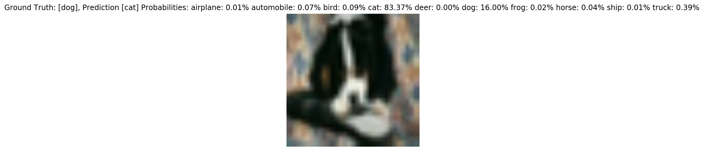


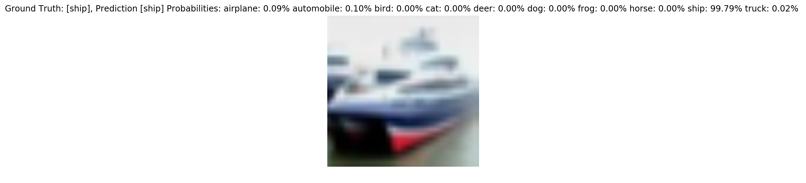


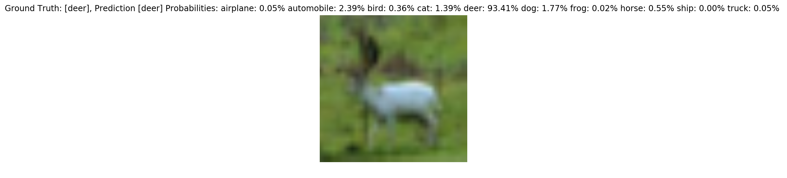


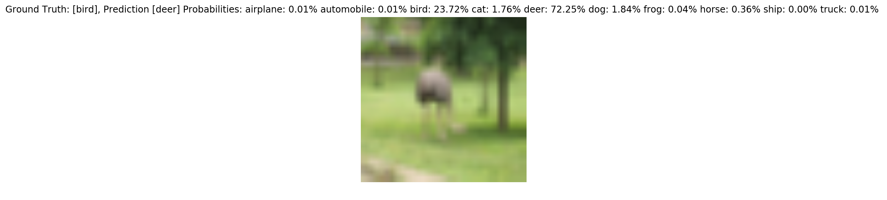


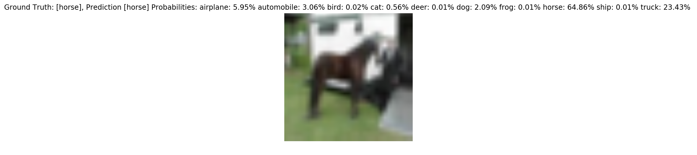


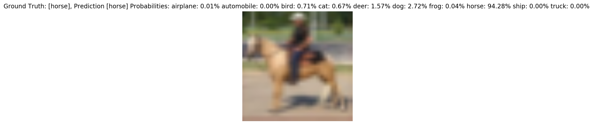


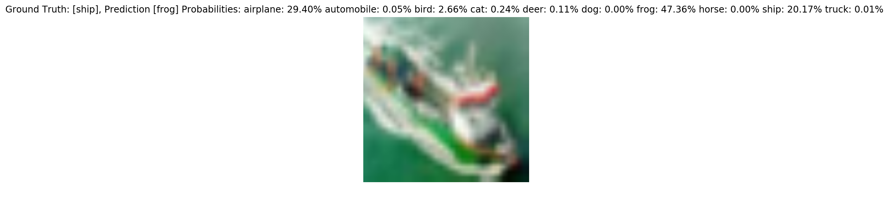


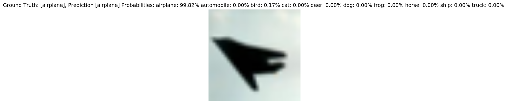


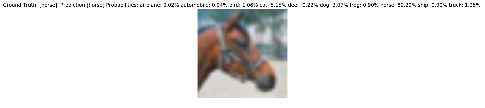


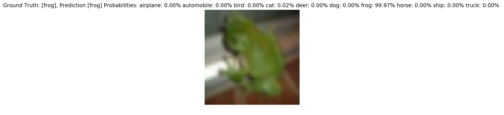


    Overall accuracy 0.7985


Indeed, the accuracy is much better. Evaluated over the whole test set of 10,000 images it is . Howerver, there is plenty of room for improvements. While our finetuned network will not be at the very bottom of the leaderboard ["state of the art in objects classification"](http://rodrigob.github.io/are_we_there_yet/build/classification_datasets_results.html), the best model achieves 96.53%. At this point the neural network is better than a human that would achieve an accuracy of only 94%. This is simply amazing.


```python

```
